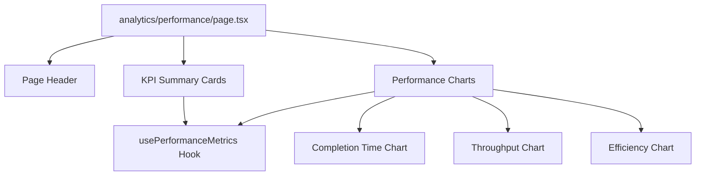

# Design Document - Analytics Performance Page

## Overview

Next.js page at /analytics/performance that displays task performance metrics with visualizations including completion times, task throughput, and efficiency indicators.

## Steering Document Alignment

### Technical Standards (tech.md)
- Next.js 14+ App Router
- TypeScript strict mode
- Chart library: Recharts or Chart.js (to be decided)

### Project Structure (structure.md)
- Page location: `apps/frontend/src/app/analytics/performance/page.tsx`
- Components: `apps/frontend/src/components/analytics/PerformanceCharts.tsx`
- Hooks: `apps/frontend/src/hooks/usePerformanceMetrics.ts`

## Code Reuse Analysis

### Existing Components to Leverage
- **Card component**: For metric cards and chart containers
- **Button component**: For filters and actions
- **Page layout**: Similar structure to dashboard and tasks pages

### Integration Points
- **API**: New performance metrics endpoint needed
- **Theme**: Charts should use theme colors
- **Date picker**: For date range selection

## Architecture



## Components and Interfaces

### PerformanceMetricsPage Component
- **Purpose:** Page component for /analytics/performance route
- **Type:** React Server Component with client components for charts
- **Dependencies:** PerformanceCharts, KPI cards, usePerformanceMetrics
- **Reuses:** Card, Button, page layout patterns

### PerformanceCharts Component
- **Purpose:** Chart visualization component
- **Props:**
  ```typescript
  interface PerformanceChartsProps {
    data: PerformanceData;
    dateRange?: DateRange;
    isLoading?: boolean;
  }
  ```
- **Dependencies:** Chart library (Recharts/Chart.js)
- **Reuses:** Theme colors, Card component

### usePerformanceMetrics Hook
- **Purpose:** Fetch and manage performance metrics data
- **Interface:**
  ```typescript
  function usePerformanceMetrics(dateRange?: DateRange): {
    metrics: PerformanceMetrics;
    isLoading: boolean;
    error: Error | null;
    refetch: () => void;
  }
  ```

## Data Models

### PerformanceMetrics Type
```typescript
interface PerformanceMetrics {
  averageCompletionTime: number;
  totalTasksCompleted: number;
  taskThroughput: number;
  efficiencyScore: number;
  completionTimesByDay: { date: string; time: number }[];
  tasksByStatus: { status: string; count: number }[];
}
```

## Testing Strategy

- Unit test: Chart components render correctly with data
- Integration test: Data fetching and display
- E2E test: Full user journey through analytics