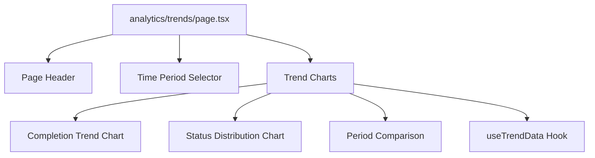

# Design Document - Analytics Trends Page

## Overview

Next.js page at /analytics/trends that displays task completion trends with time-series visualizations and period comparisons.

## Steering Document Alignment

### Technical Standards (tech.md)
- Next.js 14+ App Router
- TypeScript strict mode
- Same chart library as performance page for consistency

### Project Structure (structure.md)
- Page location: `apps/frontend/src/app/analytics/trends/page.tsx`
- Components: `apps/frontend/src/components/analytics/TrendCharts.tsx`
- Hooks: `apps/frontend/src/hooks/useTrendData.ts`

## Code Reuse Analysis

### Existing Components to Leverage
- **Chart components**: From performance page if similar
- **Card component**: For chart containers
- **Time period selector**: Shared with performance page
- **Page layout**: Similar to other analytics pages

## Architecture



## Components and Interfaces

### TrendChartsPage Component
- **Purpose:** Page component for /analytics/trends route
- **Type:** React Server Component with client chart components
- **Dependencies:** TrendCharts, useTrendData
- **Reuses:** Card, Button, page layout, chart library

### TrendCharts Component
- **Purpose:** Trend visualization component
- **Props:**
  ```typescript
  interface TrendChartsProps {
    data: TrendData;
    timePeriod: 'day' | 'week' | 'month';
    isLoading?: boolean;
  }
  ```

### useTrendData Hook
- **Purpose:** Fetch and manage trend data
- **Interface:**
  ```typescript
  function useTrendData(timePeriod: TimePeriod): {
    trends: TrendData;
    isLoading: boolean;
    error: Error | null;
  }
  ```

## Data Models

### TrendData Type
```typescript
interface TrendData {
  completionsByDay: { date: string; count: number }[];
  statusDistribution: { date: string; status: string; count: number }[];
  periodComparison: {
    current: number;
    previous: number;
    changePercent: number;
  };
}
```

## Testing Strategy

- Unit test: Trend chart components with various data
- Integration test: Time period selection and data updates
- E2E test: User journey through trends page