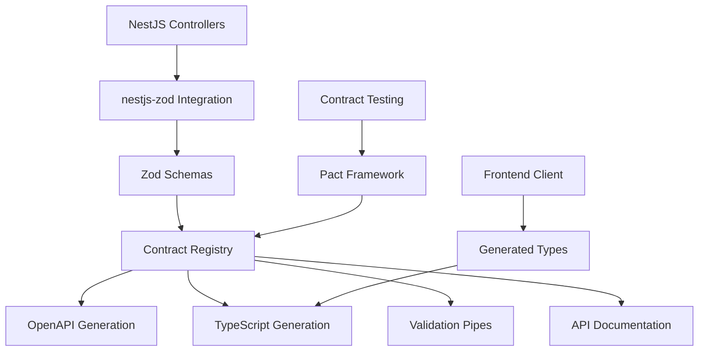
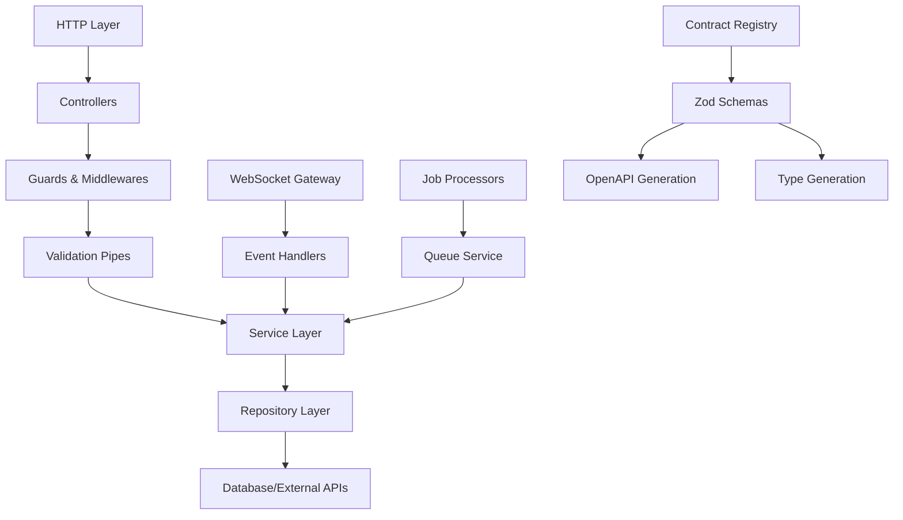

# Design Document

## Overview

This design document outlines the architecture for implementing a production-ready NestJS backend application that serves as the API gateway and orchestration layer for the Claude Code Task Manager. The backend implements a contract-driven development approach where Zod schemas serve as the single source of truth (SSOT) for API contracts, automatic OpenAPI/Swagger documentation generation, and type-safe client generation. The architecture follows SOLID principles, SLAP (Single Level of Abstraction Principle), and KISS (Keep It Simple, Stupid) principles while leveraging industry-standard libraries for reliability, observability, and maintainability.

## Steering Document Alignment

### Technical Standards (tech.md)

The design follows documented technical patterns:
- **NestJS 10+ Framework**: Structured TypeScript framework with dependency injection and modular architecture
- **Contract-Driven Development**: Zod schemas as single source of truth for validation, types, and OpenAPI generation
- **Type Safety**: TypeScript 5.0+ with strict mode for maximum type safety across all layers
- **High-Performance Logging**: Pino for structured JSON logging optimized for production observability
- **Real-time Communication**: Socket.IO via NestJS Gateway for WebSocket-based live updates
- **Enterprise Authentication**: Passport.js + JWT with CASL for attribute-based access control (ABAC)

### Project Structure (structure.md)

Implementation follows project organization conventions:
- **Backend Application**: Located at `apps/backend/` as independent NestJS application
- **Shared Packages**: Leverages `@cc-task-manager/types`, `@cc-task-manager/schemas`, `@cc-task-manager/utils`
- **Module Organization**: Feature-based modules (auth, tasks, users, queue, websocket) with clear boundaries
- **Configuration Management**: Centralized configuration following established patterns
- **Import Conventions**: Absolute imports from `src/`, workspace packages, and proper dependency hierarchy

## Code Reuse Analysis

### Existing Components to Leverage
- **Configuration Patterns**: Reuse existing `ConfigModule` setup and environment variable management
- **Database Schema**: Extend existing Prisma schema with backend-specific models and relationships
- **Shared Types**: Utilize `@cc-task-manager/types` for common data structures and interfaces
- **Validation Schemas**: Build upon `@cc-task-manager/schemas` for request/response validation
- **Utility Functions**: Leverage `@cc-task-manager/utils` for common operations and helpers

### Integration Points
- **Worker Application**: Communication through BullMQ job queue and shared database
- **Database**: PostgreSQL access through shared Prisma client and schema
- **Queue System**: BullMQ integration for job management and worker coordination
- **Configuration**: Shared environment configuration and secrets management
- **Contract System**: Integration with contract registry for API specification and testing

## Architecture

The backend implements a layered, modular architecture following domain-driven design principles with contract-driven development as the foundation.

### Contract-Driven Development Foundation



### SOLID Principles Implementation

- **Single Responsibility Principle (SRP)**: Each module, service, and controller handles one specific domain concern
- **Open/Closed Principle**: Extensibility through dependency injection, strategy patterns, and plugin architecture
- **Liskov Substitution Principle**: Interface-based design ensuring all implementations are fully substitutable
- **Interface Segregation Principle**: Specific interfaces for each client need, avoiding forced dependencies
- **Dependency Inversion Principle**: High-level modules depend on abstractions through NestJS dependency injection

### Modular Design Principles
- **Single File Responsibility**: Each file handles one specific concern (controller, service, repository, etc.)
- **Component Isolation**: Services are isolated with clear interfaces and minimal coupling
- **Service Layer Separation**: Clear separation between controllers, services, repositories, and data access
- **Utility Modularity**: Focused, single-purpose utility modules and helper functions



## Components and Interfaces

### Authentication Module (`apps/backend/src/auth/`)

- **Purpose:** JWT-based authentication with Passport.js integration and CASL authorization
- **Interfaces:**
  - `POST /auth/login` - User authentication
  - `POST /auth/refresh` - Token refresh
  - `GET /auth/profile` - User profile retrieval
- **Dependencies:** Passport.js, JWT, CASL, User service
- **Reuses:** Shared user types, validation schemas, configuration patterns
- **SOLID Implementation:**
  - SRP: Separate strategies for local/JWT authentication
  - OCP: Extensible through new Passport strategies
  - DIP: Depends on user service abstraction

### Task Management Module (`apps/backend/src/tasks/`)

- **Purpose:** CRUD operations for Claude Code tasks with queue integration
- **Interfaces:**
  - `POST /tasks` - Create new task (Zod validated)
  - `GET /tasks` - List tasks with pagination/filtering
  - `GET /tasks/:id` - Retrieve specific task
  - `PUT /tasks/:id` - Update task status
  - `DELETE /tasks/:id` - Cancel/delete task
- **Dependencies:** Task repository, Queue service, WebSocket gateway
- **Reuses:** Task schemas from `@cc-task-manager/schemas`, shared utilities
- **Contract-Driven:** All endpoints use Zod schemas for validation and OpenAPI generation

### WebSocket Gateway (`apps/backend/src/websocket/`)

- **Purpose:** Real-time task status updates and system notifications
- **Interfaces:**
  - Connection authentication via JWT
  - Room-based user targeting
  - Task progress broadcasting
  - System status updates
- **Dependencies:** Socket.IO, Authentication guard, Task service
- **Reuses:** Event schemas, authentication patterns, user management
- **SOLID Implementation:**
  - SRP: Separate handlers for different event types
  - ISP: Client-specific event interfaces

### Queue Management Module (`apps/backend/src/queue/`)

- **Purpose:** BullMQ integration for job scheduling and worker coordination
- **Interfaces:**
  - Job creation and enqueueing
  - Queue monitoring and health checks
  - Job status tracking and updates
  - Failed job retry management
- **Dependencies:** BullMQ, Redis, Event emitter
- **Reuses:** Job schemas, configuration management, logging utilities
- **Integration:** Direct communication with worker application via Redis

### User Management Module (`apps/backend/src/users/`)

- **Purpose:** User CRUD operations and profile management
- **Interfaces:**
  - `GET /users/profile` - Current user profile
  - `PUT /users/profile` - Update user profile
  - `GET /users/tasks` - User's task history
- **Dependencies:** User repository, Authentication service
- **Reuses:** User schemas, validation patterns, database utilities
- **Authorization:** CASL-based attribute access control

### Configuration Module (`apps/backend/src/config/`)

- **Purpose:** Centralized configuration management with validation
- **Interfaces:**
  - Environment variable loading
  - Configuration validation with Zod
  - Type-safe configuration access
- **Dependencies:** `@nestjs/config`, Zod validation schemas
- **Reuses:** Shared configuration patterns, environment setup
- **SSOT Implementation:** Single configuration schema used across modules

## Data Models

### API Request/Response Schemas (Zod-based)

```typescript
// Task Creation Contract
const CreateTaskSchema = z.object({
  name: z.string().min(1).max(255),
  description: z.string().optional(),
  command: z.string().min(1),
  arguments: z.record(z.unknown()).optional(),
  workingDirectory: z.string().optional(),
  timeout: z.number().int().positive().optional(),
});

// Task Response Contract
const TaskResponseSchema = z.object({
  id: z.string().uuid(),
  name: z.string(),
  status: z.enum(['pending', 'running', 'completed', 'failed', 'cancelled']),
  progress: z.number().min(0).max(100),
  createdAt: z.date(),
  updatedAt: z.date(),
  result: z.unknown().optional(),
  error: z.string().optional(),
});

// OpenAPI generation through nestjs-zod
export const CreateTaskDto = createZodDto(CreateTaskSchema);
export const TaskResponseDto = createZodDto(TaskResponseSchema);
```

### Database Models (Prisma)

```prisma
model User {
  id        String   @id @default(uuid())
  email     String   @unique
  password  String
  name      String?
  role      UserRole @default(USER)
  tasks     Task[]
  createdAt DateTime @default(now())
  updatedAt DateTime @updatedAt
}

model Task {
  id              String     @id @default(uuid())
  name            String
  description     String?
  command         String
  arguments       Json?
  workingDirectory String?
  status          TaskStatus @default(PENDING)
  progress        Int        @default(0)
  result          Json?
  error           String?
  logs            String[]
  userId          String
  user            User       @relation(fields: [userId], references: [id])
  createdAt       DateTime   @default(now())
  updatedAt       DateTime   @updatedAt
}
```

### WebSocket Event Schemas

```typescript
const TaskStatusUpdateSchema = z.object({
  taskId: z.string().uuid(),
  status: z.enum(['pending', 'running', 'completed', 'failed', 'cancelled']),
  progress: z.number().min(0).max(100),
  timestamp: z.date(),
  message: z.string().optional(),
});

const SystemNotificationSchema = z.object({
  type: z.enum(['info', 'warning', 'error']),
  message: z.string(),
  timestamp: z.date(),
  metadata: z.record(z.unknown()).optional(),
});
```

## Error Handling

### Contract-Driven Error Responses

```typescript
const ErrorResponseSchema = z.object({
  statusCode: z.number(),
  message: z.string(),
  error: z.string(),
  timestamp: z.string(),
  path: z.string(),
  details: z.array(z.object({
    field: z.string(),
    message: z.string(),
  })).optional(),
});
```

### Error Scenarios

1. **Validation Errors**
   - **Handling:** Zod validation pipes catch and format validation errors automatically
   - **User Impact:** Clear field-level error messages with HTTP 400 Bad Request

2. **Authentication Failures**
   - **Handling:** JWT Guard returns structured error with expiration details
   - **User Impact:** HTTP 401 Unauthorized with token refresh guidance

3. **Authorization Failures**
   - **Handling:** CASL Guard provides detailed permission error context
   - **User Impact:** HTTP 403 Forbidden with specific permission requirements

4. **Queue Service Errors**
   - **Handling:** Circuit breaker pattern with fallback mechanisms
   - **User Impact:** HTTP 503 Service Unavailable with retry guidance

5. **Database Connection Errors**
   - **Handling:** Connection retry logic with exponential backoff
   - **User Impact:** HTTP 500 Internal Server Error with correlation ID for tracking

### Global Exception Filter

```typescript
@Catch()
export class GlobalExceptionFilter implements ExceptionFilter {
  catch(exception: unknown, host: ArgumentsHost) {
    // Structured error logging with Pino
    // Contract-based error response formatting
    // Correlation ID tracking
    // Security-safe error messages
  }
}
```

## OpenAPI/Swagger Integration

### Automated Documentation Generation

```typescript
// main.ts setup
import { patchNestjsSwagger } from '@wahyubucil/nestjs-zod-openapi';

async function bootstrap() {
  const app = await NestFactory.create(AppModule);

  // Patch Swagger to understand Zod schemas
  patchNestjsSwagger();

  const config = new DocumentBuilder()
    .setTitle('Claude Code Task Manager API')
    .setDescription('Contract-driven API for AI task management')
    .setVersion('1.0')
    .addBearerAuth()
    .build();

  const document = SwaggerModule.createDocument(app, config);
  SwaggerModule.setup('api', app, document);
}
```

### Controller Implementation

```typescript
@Controller('tasks')
@ApiTags('Tasks')
export class TaskController {
  @Post()
  @ApiOperation({ summary: 'Create a new task' })
  @ApiCreatedResponse({ type: TaskResponseDto })
  @ApiBadRequestResponse({ type: ErrorResponseDto })
  async createTask(
    @Body() createTaskDto: CreateTaskDto,
    @GetUser() user: User,
  ): Promise<TaskResponseDto> {
    // Implementation with automatic validation
    // OpenAPI documentation generated from Zod schemas
  }
}
```

## Testing Strategy

### Contract Testing with Pact

```typescript
// Consumer-driven contract testing
describe('Claude Code SDK Integration', () => {
  beforeEach(() => {
    mockProvider
      .given('task execution request')
      .uponReceiving('a valid task execution')
      .withRequest({
        method: 'POST',
        path: '/execute',
        body: like(CreateTaskSchema),
      })
      .willRespondWith({
        status: 200,
        body: like(TaskResponseSchema),
      });
  });
});
```

### Unit Testing

- **Schema Validation Testing**: Comprehensive Zod schema validation test coverage
- **Service Layer Testing**: Mock-based testing with dependency injection
- **Controller Testing**: Request/response testing with contract validation
- **Guard Testing**: Authentication and authorization logic verification

### Integration Testing

- **API Contract Testing**: End-to-end API contract validation
- **Database Integration**: Repository pattern testing with test database
- **Queue Integration**: BullMQ job processing and event handling
- **WebSocket Testing**: Real-time communication flow validation

### End-to-End Testing

- **User Authentication Flow**: Complete login/logout/refresh cycle
- **Task Management Workflow**: Create, monitor, update, and complete tasks
- **Real-time Updates**: WebSocket event delivery verification
- **Error Handling**: Comprehensive error scenario coverage