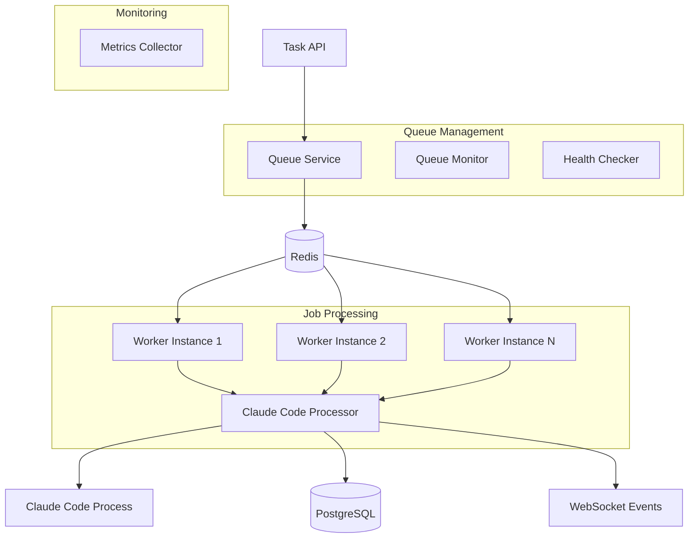

# Design Document

## Overview

The BullMQ Integration design provides enterprise-grade job queue processing using Redis-backed BullMQ with sophisticated retry mechanisms, distributed processing, and comprehensive monitoring. This design integrates seamlessly with the task management system to provide reliable, scalable Claude Code task execution with automatic failure recovery and performance optimization.

## Steering Document Alignment

### Technical Standards (tech.md)
- **BullMQ**: Robust job queue system with Redis backend for reliable task processing
- **Redis**: High-performance caching and job queue persistence with clustering support
- **Node.js 18+**: Modern runtime with PM2 process management for production deployment
- **TypeScript**: Type-safe job definitions and processor interfaces

### Project Structure (structure.md)
- **Queue Module**: `apps/backend/src/queue/` for queue management
- **Worker Application**: `apps/worker/src/` dedicated to job processing
- **Processors**: `apps/worker/src/processors/` for job-specific processing logic
- **Monitoring**: `apps/backend/src/queue/monitoring/` for queue health tracking

## Code Reuse Analysis

### Existing Components to Leverage
- **Worker Service**: Extend existing `apps/worker/src/worker.service.ts` with BullMQ integration
- **Queue Service**: Build upon existing `apps/backend/src/queue/` infrastructure
- **Database Integration**: Utilize existing Prisma integration for job state persistence
- **Logging System**: Extend existing structured logging for queue operations

### Integration Points
- **Database Schema**: Integrate with QueueJob and JobAttempt entities
- **Task Service**: Coordinate with task CRUD API for job lifecycle management
- **WebSocket Events**: Emit job progress updates for real-time monitoring
- **System Metrics**: Feed into monitoring system for performance tracking

## Architecture

The queue system follows a distributed architecture with clear separation between job creation, processing, and monitoring:



### Modular Design Principles
- **Single File Responsibility**: Each processor handles one specific job type
- **Component Isolation**: Queue management separated from job processing logic
- **Service Layer Separation**: Clear boundaries between job creation, execution, and monitoring
- **Utility Modularity**: Shared job utilities and monitoring tools across processors

## Components and Interfaces

### QueueService
- **Purpose:** Job queue management with creation, scheduling, and monitoring capabilities
- **Interfaces:** Type-safe job creation, priority management, queue manipulation operations
- **Dependencies:** Redis connection, database integration, job definitions
- **Reuses:** Existing service patterns, dependency injection, configuration management

### ClaudeCodeProcessor
- **Purpose:** Specialized processor for Claude Code task execution with full lifecycle management
- **Interfaces:** BullMQ processor interface with progress tracking and error handling
- **Dependencies:** Claude Code wrapper, database persistence, WebSocket notifications
- **Reuses:** Existing worker patterns, process management, error handling systems

### QueueMonitor
- **Purpose:** Real-time queue health monitoring with metrics collection and alerting
- **Interfaces:** Monitoring dashboard integration, metrics export, health check endpoints
- **Dependencies:** Redis monitoring, job statistics, system performance metrics
- **Reuses:** Existing monitoring patterns, metrics collection, dashboard integration

### JobDefinitions
- **Purpose:** Type-safe job definitions with validation and configuration management
- **Interfaces:** Strongly-typed job data structures with Zod validation
- **Dependencies:** Shared type definitions, validation schemas
- **Reuses:** Existing validation patterns, type generation, schema sharing

## Data Models

### Job Types and Schemas
```typescript
// Base job interface
export interface BaseJob {
  id: string;
  type: JobType;
  priority: JobPriority;
  data: unknown;
  options: JobOptions;
}

// Claude Code specific job
export const ClaudeCodeJobSchema = z.object({
  taskId: z.string().uuid(),
  prompt: z.string().min(1),
  config: z.object({
    timeout: z.number().int().min(1).max(3600).default(300),
    retryAttempts: z.number().int().min(0).max(5).default(3),
    workingDirectory: z.string().optional(),
    environment: z.record(z.string()).optional()
  }).optional(),
  userId: z.string().uuid(),
  projectId: z.string().uuid().optional()
});

export type ClaudeCodeJobData = z.infer<typeof ClaudeCodeJobSchema>;
```

### Queue Configuration
```typescript
export interface QueueConfig {
  name: string;
  redis: {
    host: string;
    port: number;
    password?: string;
    db: number;
  };
  defaultJobOptions: {
    removeOnComplete: number;
    removeOnFail: number;
    attempts: number;
    backoff: {
      type: 'exponential' | 'fixed';
      delay: number;
    };
  };
  concurrency: number;
}

export const CLAUDE_CODE_QUEUE_CONFIG: QueueConfig = {
  name: 'claude-code-tasks',
  redis: {
    host: process.env.REDIS_HOST || 'localhost',
    port: parseInt(process.env.REDIS_PORT || '6379'),
    password: process.env.REDIS_PASSWORD,
    db: parseInt(process.env.REDIS_DB || '0')
  },
  defaultJobOptions: {
    removeOnComplete: 50,
    removeOnFail: 100,
    attempts: 3,
    backoff: {
      type: 'exponential',
      delay: 2000
    }
  },
  concurrency: 10
};
```

### Job Progress Tracking
```typescript
export interface JobProgress {
  percentage: number; // 0-100
  stage: ProgressStage;
  message?: string;
  details?: Record<string, any>;
  timestamp: Date;
}

export enum ProgressStage {
  INITIALIZING = 'initializing',
  VALIDATING = 'validating',
  EXECUTING = 'executing',
  PROCESSING_OUTPUT = 'processing_output',
  FINALIZING = 'finalizing',
  COMPLETED = 'completed'
}
```

### Retry and Error Handling
```typescript
export interface RetryConfig {
  attempts: number;
  backoffType: 'exponential' | 'fixed' | 'linear';
  backoffDelay: number;
  maxBackoffDelay?: number;
  jitter?: boolean;
}

export interface JobError {
  name: string;
  message: string;
  stack?: string;
  code?: string;
  isRetryable: boolean;
  context?: Record<string, any>;
}
```

## Error Handling

### Error Scenarios
1. **Redis Connection Failures**
   - **Handling:** Connection pooling with automatic retry, circuit breaker patterns
   - **User Impact:** Graceful degradation with local queuing, automatic recovery notification

2. **Job Processing Failures**
   - **Handling:** Exponential backoff retry with dead letter queue for failed jobs
   - **User Impact:** Automatic retry attempts with user notification on final failure

3. **Worker Process Crashes**
   - **Handling:** PM2 automatic restart, job reassignment to healthy workers
   - **User Impact:** Transparent recovery with minimal processing delay

4. **Queue Overflow**
   - **Handling:** Priority-based job scheduling with overflow handling and rate limiting
   - **User Impact:** Queue status visibility with estimated processing times

5. **Memory and Resource Limits**
   - **Handling:** Worker resource monitoring with automatic scaling and job throttling
   - **User Impact:** Consistent performance with automatic load balancing

## Testing Strategy

### Unit Testing
- Job processor logic testing with mocked dependencies
- Queue service testing with Redis memory store
- Retry mechanism testing with controlled failure scenarios
- Job validation testing with comprehensive schema coverage

### Integration Testing
- Redis integration testing with real Redis instances
- Multi-worker coordination testing with distributed scenarios
- Database persistence testing with transaction boundaries
- WebSocket event emission testing with real-time updates

### End-to-End Testing
- Complete job lifecycle testing from creation to completion
- Failure recovery testing with worker crashes and Redis failures
- Performance testing under high load with concurrent jobs
- Monitoring and alerting testing with real system conditions