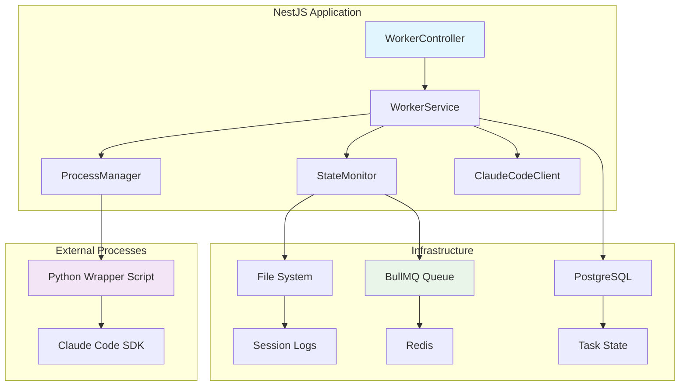

# Design Document

## Overview

The Claude Code Manage feature implements a minimal worker system to validate the feasibility of Claude Code SDK integration within the broader task management architecture. This design provides the foundational proof-of-concept for process spawning, monitoring, and lifecycle management of AI-powered tasks through a structured Node.js worker that interfaces with the Claude Code Python SDK.

## Steering Document Alignment

### Technical Standards (tech.md)
This design follows the proven technology stack from `request_and_lib_selection_without_gui.md` with specific library selections optimized for single developer productivity and AI-assisted development:

**Core Framework Stack:**
- **NestJS**: Opinionated framework with structured module/controller/service architecture for consistency and maintainability
- **TypeScript-First**: Leveraging NestJS's first-class TypeScript support for comprehensive type safety
- **BullMQ**: Node.js-native job queue with retry, delay, and rate limiting capabilities for robust background processing
- **@nestjs/bullmq**: Official integration package for seamless NestJS + BullMQ integration

**Process & Infrastructure Management:**
- **PM2**: Industry-standard Node.js process manager for automatic restarts, clustering, and log management
- **child_process.spawn**: Secure process spawning to prevent command injection vulnerabilities
- **chokidar**: Cross-platform file system watcher for session log monitoring (more stable than fs.watch)

### Project Structure (structure.md)
The implementation follows modular design principles aligned with the recommended stack:
- **Service Layer**: NestJS injectable services following dependency injection patterns
- **Configuration**: @nestjs/config for environment-based worker settings and validation
- **Logging**: Pino for high-performance structured JSON logging throughout worker operations
- **Validation**: Zod schemas for type-safe data validation and error prevention
- **Utilities**: lodash-es for proven utility functions with tree-shaking optimization

## Selected Libraries Implementation

### Core Dependencies
```json
{
  "@nestjs/core": "^10.x",
  "@nestjs/common": "^10.x",
  "@nestjs/config": "^3.x",
  "@nestjs/bullmq": "^10.x",
  "bullmq": "^4.x",
  "zod": "^3.x",
  "pino": "^8.x",
  "chokidar": "^3.x",
  "lodash-es": "^4.x"
}
```

### Library Integration Strategy
- **@nestjs/config**: Centralized configuration with environment validation using Zod schemas
- **BullMQ + @nestjs/bullmq**: Task queue integration with built-in retry logic and Redis persistence
- **Pino**: Structured logging with correlation IDs for request tracing across worker processes
- **chokidar**: Reliable file system monitoring with cross-platform compatibility for session log detection
- **Zod**: Runtime validation for process configurations, API requests, and external data parsing
- **lodash-es**: Utility functions for data manipulation with tree-shaking to minimize bundle size

## Code Reuse Analysis

### Existing Components to Leverage
- **NestJS Module System**: Will extend existing application modules for worker functionality
- **Configuration Service**: Reuse existing @nestjs/config setup for worker parameters
- **Logging Infrastructure**: Leverage existing Pino logger configuration
- **Database Layer**: Extend existing Prisma models for task state persistence

### Integration Points
- **BullMQ Queue System**: Integrate with existing job processing infrastructure
- **WebSocket Gateway**: Connect to existing real-time update system for status broadcasts
- **Database Schema**: Extend existing task tables with worker-specific fields
- **Error Handling**: Integrate with existing structured error response patterns

## Architecture

The design follows a multi-layered architecture that separates process management, monitoring, and Claude Code integration concerns:



### Modular Design Principles
- **Single File Responsibility**: Each service handles one aspect (spawning, monitoring, or communication)
- **Component Isolation**: ProcessManager, StateMonitor, and ClaudeCodeClient are independent modules
- **Service Layer Separation**: Clear boundaries between API layer, business logic, and external integrations
- **Utility Modularity**: Focused utilities for PID monitoring, file watching, and JSON parsing

## Components and Interfaces

### WorkerService
- **Purpose:** Orchestrates Claude Code task execution and coordinates between components
- **Interfaces:**
  - `executeTask(taskData: TaskExecutionRequest): Promise<TaskResult>`
  - `stopTask(taskId: string): Promise<void>`
  - `getTaskStatus(taskId: string): Promise<TaskStatus>`
- **Dependencies:** ProcessManager, StateMonitor, ClaudeCodeClient
- **Reuses:** NestJS injectable patterns, existing configuration service

### ProcessManager
- **Purpose:** Handles Claude Code process spawning, lifecycle management, and signal handling
- **Interfaces:**
  - `spawnClaudeProcess(config: ProcessConfig): Promise<ChildProcess>`
  - `terminateProcess(pid: number): Promise<void>`
  - `isProcessAlive(pid: number): boolean`
- **Dependencies:** Node.js child_process, Python wrapper script
- **Libraries Used:**
  - **child_process.spawn**: Secure process creation with array arguments to prevent injection
  - **Pino logger**: Structured logging with correlation IDs for process lifecycle events
  - **Zod**: Validation of ProcessConfig parameters before spawning

### StateMonitor
- **Purpose:** Real-time monitoring of process health, activity detection, and state transitions
- **Interfaces:**
  - `startMonitoring(taskId: string, pid: number): void`
  - `stopMonitoring(taskId: string): void`
  - `getCurrentState(taskId: string): TaskState`
- **Dependencies:** chokidar file watcher, BullMQ for state updates
- **Libraries Used:**
  - **chokidar**: Cross-platform file system watcher with awaitWriteFinish for complete file updates
  - **BullMQ**: State change notifications via job progress updates and events
  - **lodash-es**: Utility functions for state data manipulation (debounce, throttle, etc.)
  - **Pino**: Structured logging of all state transitions with timestamps

### ClaudeCodeClient
- **Purpose:** Abstraction layer for Claude Code SDK communication through Python wrapper
- **Interfaces:**
  - `sendPrompt(prompt: string, options: ClaudeOptions): void`
  - `parseResponse(jsonOutput: string): ParsedResponse`
  - `handleError(errorData: ErrorData): StructuredError`
- **Dependencies:** Python wrapper script, structured JSON parsing
- **Libraries Used:**
  - **Zod**: Runtime validation of Claude Code responses and configuration options
  - **Pino**: Detailed logging of all SDK interactions without exposing sensitive prompt data
  - **lodash-es**: JSON data transformation and error handling utilities
  - **@nestjs/config**: Access to Claude Code SDK configuration and Python executable paths

### PythonWrapper (External Script)
- **Purpose:** Bridge between Node.js worker and Claude Code Python SDK
- **Interfaces:**
  - Command line arguments: `--job-id`, `--session-name`, `--working-dir`
  - stdin: JSON prompt data
  - stdout: Structured JSON progress/result messages
- **Dependencies:** Claude Code Python SDK, signal handling
- **Reuses:** Standard Python logging patterns, JSON communication protocol

## Data Models

### TaskExecutionRequest
```typescript
interface TaskExecutionRequest {
  id: string;
  prompt: string;
  sessionName: string;
  workingDirectory: string;
  options: ClaudeCodeOptions;
  timeoutMs?: number;
}
```

### TaskStatus
```typescript
enum TaskState {
  PENDING = 'pending',
  RUNNING = 'running',
  ACTIVE = 'active',
  IDLE = 'idle',
  COMPLETED = 'completed',
  FAILED = 'failed',
  CANCELLED = 'cancelled'
}

interface TaskStatus {
  taskId: string;
  state: TaskState;
  pid?: number;
  progress?: string;
  lastActivity: Date;
  error?: string;
  exitCode?: number;
}
```

### ProcessConfig
```typescript
interface ProcessConfig {
  jobId: string;
  sessionName: string;
  workingDirectory: string;
  pythonExecutable?: string;
  wrapperScriptPath: string;
  unbuffered: boolean;
}
```

## Error Handling

### Error Scenarios
1. **Process Spawn Failure**
   - **Handling:** Log error details, mark task as failed, clean up resources
   - **User Impact:** Clear error message indicating spawn failure with diagnostic info

2. **Claude Code SDK Errors**
   - **Handling:** Parse stderr from Python wrapper, categorize error types
   - **User Impact:** Structured error messages distinguishing SDK vs system issues

3. **Process Timeout/Hang**
   - **Handling:** SIGTERM followed by SIGKILL after grace period, mark as failed
   - **User Impact:** Timeout notification with partial results if available

4. **File System Monitoring Failure**
   - **Handling:** Fall back to PID-only monitoring, log degraded state
   - **User Impact:** Reduced monitoring granularity but continued operation

5. **Python Wrapper Crash**
   - **Handling:** Capture exit code and stderr, attempt automatic recovery
   - **User Impact:** Detailed crash report with recovery options

## Testing Strategy

### Unit Testing
- **ProcessManager**: Mock child_process.spawn, test signal handling and PID management
- **StateMonitor**: Mock file system events, test state transition logic
- **ClaudeCodeClient**: Mock Python wrapper responses, test JSON parsing accuracy
- **WorkerService**: Mock all dependencies, test orchestration and error propagation

### Integration Testing
- **Process Lifecycle**: Full spawn-to-completion cycles with real Python wrapper
- **Monitoring System**: File system changes triggering correct state updates
- **Error Recovery**: Intentional failures to validate recovery mechanisms
- **Signal Handling**: SIGTERM/SIGKILL scenarios with graceful shutdown testing

### End-to-End Testing
- **Complete Task Execution**: Real Claude Code SDK integration with sample tasks
- **Multi-task Concurrency**: Multiple workers handling different tasks simultaneously
- **Failure Scenarios**: Network issues, process crashes, and recovery validation
- **Performance Testing**: Resource usage monitoring under sustained load