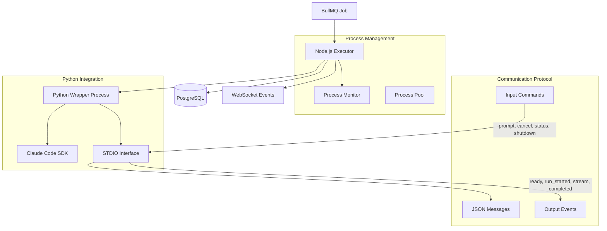

# Design Document

## Overview

The Claude Code Wrapper Integration design provides seamless communication between the task manager and Claude Code SDK through a standardized STDIO interface based on the documented specification. This design implements reliable AI task execution with structured JSON communication, comprehensive process monitoring, and robust error handling for enterprise-grade Claude Code integration.

## Steering Document Alignment

### Technical Standards (tech.md)
- **Python 3.11+**: Integration layer for Claude Code SDK wrapper execution
- **Node.js Worker**: TypeScript executor coordinating with Python processes
- **Process Isolation**: Secure child_process.spawn execution preventing command injection
- **Structured Logging**: JSON output format for analysis and monitoring

### Project Structure (structure.md)
- **Worker Application**: `apps/worker/src/claude-code/` for integration components
- **Python Wrapper**: `apps/worker/src/claude-code/wrapper.py` implementing STDIO interface
- **Node.js Executor**: `apps/worker/src/claude-code/executor.ts` for process coordination
- **Monitoring**: `apps/worker/src/monitoring/` for process health tracking

## Code Reuse Analysis

### Existing Components to Leverage
- **Worker Service**: Extend existing `apps/worker/src/worker.service.ts` with Claude Code integration
- **Process Manager**: Build upon existing `apps/worker/src/process-manager.service.ts` patterns
- **State Monitor**: Utilize existing `apps/worker/src/state-monitor.service.ts` for health tracking
- **Claude Code Client**: Enhance existing `apps/worker/src/claude-code-client.service.ts`

### Integration Points
- **BullMQ Processor**: Integrate with job processing system for task execution
- **Database Persistence**: Store execution results and logs in TaskExecution entities
- **WebSocket Events**: Emit real-time progress updates for dashboard monitoring
- **Wrapper Specification**: Implement documented STDIO interface from claude_wrapper.py analysis

## Architecture

The integration follows a layered architecture with clear separation between Node.js coordination and Python execution:



### Modular Design Principles
- **Single File Responsibility**: Each component handles one aspect of Claude Code integration
- **Component Isolation**: Process management separated from communication protocol
- **Service Layer Separation**: Clear boundaries between coordination, execution, and monitoring
- **Utility Modularity**: Shared utilities for STDIO parsing, process management, and error handling

## Components and Interfaces

### ClaudeCodeExecutor
- **Purpose:** Node.js coordinator managing Python process lifecycle and communication
- **Interfaces:** BullMQ processor interface with progress tracking and error handling
- **Dependencies:** Process management utilities, STDIO communication, database persistence
- **Reuses:** Existing executor patterns, process monitoring, structured logging

### PythonWrapperProcess
- **Purpose:** Python implementation of documented STDIO interface for Claude Code SDK
- **Interfaces:** Standardized JSON communication with command handling and event emission
- **Dependencies:** Claude Code SDK, STDIO protocol implementation, error handling
- **Reuses:** Documented wrapper specification, JSON communication patterns

### ProcessMonitor
- **Purpose:** Health monitoring and resource tracking for Claude Code processes
- **Interfaces:** Process lifecycle events, resource metrics, health status reporting
- **Dependencies:** System monitoring utilities, process management, alerting system
- **Reuses:** Existing monitoring patterns, metrics collection, health check systems

### STDIOProtocol
- **Purpose:** Type-safe implementation of documented STDIO communication specification
- **Interfaces:** Command/event serialization, protocol validation, error handling
- **Dependencies:** JSON schema validation, message parsing, communication utilities
- **Reuses:** Documented protocol specification, existing validation patterns

## Data Models

### STDIO Command Interface
```typescript
// Input commands based on documented specification
export interface PromptCommand {
  action: 'prompt';
  prompt: string;
  run_id?: string;
  options?: {
    cwd?: string;
    timeout?: number;
    exit_on_complete?: boolean;
    session_id?: string;
  };
}

export interface CancelCommand {
  action: 'cancel';
  run_id?: string;
}

export interface StatusCommand {
  action: 'status';
}

export interface ShutdownCommand {
  action: 'shutdown';
}

export type STDIOCommand = PromptCommand | CancelCommand | StatusCommand | ShutdownCommand;
```

### STDIO Event Interface
```typescript
// Output events based on documented specification
export interface ReadyEvent {
  event: 'ready';
  timestamp: string;
  state: string;
  version: number;
  outcome: string;
  reason: string;
  tags: string[];
}

export interface RunStartedEvent {
  event: 'run_started';
  run_id: string;
  timestamp: string;
  options: Record<string, any>;
  state: string;
}

export interface StreamEvent {
  event: 'stream';
  timestamp: string;
  run_id: string;
  payload: any;
}

export interface RunCompletedEvent {
  event: 'run_completed';
  timestamp: string;
  run_id: string;
  version: number;
  outcome: 'completed' | 'failed' | 'cancelled';
  reason: string;
  tags: string[];
  message?: string;
}

export type STDIOEvent = ReadyEvent | RunStartedEvent | StreamEvent | RunCompletedEvent;
```

### Process Management
```typescript
export interface ProcessConfig {
  pythonExecutable: string;
  wrapperScript: string;
  workingDirectory: string;
  environment: Record<string, string>;
  timeout: number;
  maxRetries: number;
  healthCheckInterval: number;
}

export interface ProcessState {
  pid: number | null;
  status: 'initializing' | 'ready' | 'busy' | 'error' | 'terminated';
  startTime: Date;
  lastActivity: Date;
  currentRunId: string | null;
  resourceUsage: {
    cpu: number;
    memory: number;
    handles: number;
  };
}

export interface ProcessMetrics {
  processId: string;
  uptime: number;
  totalJobs: number;
  successfulJobs: number;
  failedJobs: number;
  averageExecutionTime: number;
  lastJobCompleted: Date | null;
  resourceStats: {
    peakMemory: number;
    averageCpu: number;
    totalCpuTime: number;
  };
}
```

### Error Handling Types
```typescript
export interface ProcessError {
  type: 'startup' | 'communication' | 'execution' | 'timeout' | 'crash';
  code: string;
  message: string;
  details?: Record<string, any>;
  retryable: boolean;
  timestamp: Date;
}

export interface STDIOError {
  event: 'error';
  timestamp: string;
  error: string;
  details?: string;
  run_id?: string;
}
```

## Error Handling

### Error Scenarios
1. **Process Startup Failures**
   - **Handling:** Retry with exponential backoff, environment validation, dependency checking
   - **User Impact:** Clear error messages with system requirements and configuration guidance

2. **STDIO Communication Errors**
   - **Handling:** Protocol validation, message retry, connection recovery, timeout handling
   - **User Impact:** Automatic recovery with progress preservation and user notification

3. **Claude Code SDK Errors**
   - **Handling:** Error parsing from SDK output, structured error reporting, recovery suggestions
   - **User Impact:** Clear error context with actionable troubleshooting steps

4. **Process Resource Exhaustion**
   - **Handling:** Resource monitoring, automatic termination, cleanup procedures, alerting
   - **User Impact:** System stability maintained with clear resource limit notifications

5. **Task Execution Timeouts**
   - **Handling:** Graceful timeout handling, partial result preservation, cleanup procedures
   - **User Impact:** Clear timeout notifications with option to extend or retry

## Testing Strategy

### Unit Testing
- STDIO protocol implementation testing with mock processes
- Process management testing with controlled subprocess scenarios
- Error handling testing with comprehensive failure simulation
- Communication protocol testing with JSON schema validation

### Integration Testing
- Python wrapper integration testing with real Claude Code SDK
- Process lifecycle testing with actual subprocess management
- BullMQ integration testing with job processing workflows
- Database persistence testing with execution result storage

### End-to-End Testing
- Complete task execution testing from queue to completion
- Failure recovery testing with process crashes and restarts
- Performance testing under concurrent task load
- Resource monitoring testing with real system constraints
- STDIO communication testing with protocol compliance verification