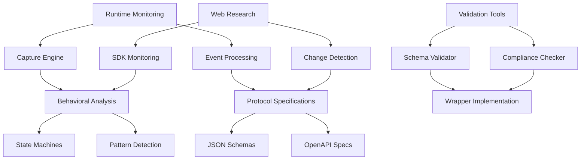

# Design Document

## Overview

The Claude Code Wrapper Specifications system is a comprehensive specification framework that defines formal contracts, schemas, and behavioral patterns for Claude Code integration. The system consists of five core modules: Protocol Specifications (JSON schemas), Behavioral Analysis (state machines), Runtime Monitoring (behavior capture), Web Research (change detection), and Validation Tools (compliance checking). This design ensures robust, type-safe, and future-proof Claude Code wrapper development through contract-driven development principles.

## Steering Document Alignment

### Technical Standards (tech.md)
The design follows modern TypeScript/Python patterns with:
- JSON Schema-based contract validation
- Modular component architecture
- Async/await patterns for runtime monitoring
- Event-driven behavioral analysis
- RESTful API design for web research integration

### Project Structure (structure.md)
Implementation follows the existing workspace structure:
- `claudeCodeSpecs/` directory for all specification artifacts
- `packages/` for reusable schema and validation modules
- `scripts/` for automation and research tools
- Integration with existing test and build infrastructure

## Code Reuse Analysis

### Existing Components to Leverage
- **claude_wrapper.py**: Core wrapper patterns, event handling, and state management logic
- **spec_workflow_automation.py**: Completion detection patterns, debug systems, and session lifecycle management
- **packages/schemas**: Existing TypeScript schema infrastructure and validation patterns
- **packages/types**: Type definition patterns and worker communication interfaces
- **Jest testing infrastructure**: Test patterns, coverage setup, and validation frameworks

### Integration Points
- **NestJS framework**: Web research API endpoints and monitoring services
- **BullMQ**: Background job processing for periodic research and monitoring
- **Existing CLI tools**: Integration with workflow automation and specification management
- **File system**: Schema storage, runtime data capture, and specification versioning

## Architecture

The system follows a modular microservice-inspired architecture with clear separation of concerns. Each module operates independently but communicates through well-defined interfaces. The design emphasizes observability, maintainability, and extensibility to adapt to Claude Code evolution.

### Modular Design Principles
- **Single File Responsibility**: Each schema file covers one protocol domain (commands, events, states)
- **Component Isolation**: Runtime monitoring, web research, and validation operate independently
- **Service Layer Separation**: Clear boundaries between data capture, analysis, and specification generation
- **Utility Modularity**: Focused tools for schema validation, behavior analysis, and change detection



## Components and Interfaces

### Protocol Specifications Module
- **Purpose:** Define formal JSON schemas and OpenAPI specifications for all Claude Code communication protocols
- **Interfaces:**
  - `generateSchemas()`: Create JSON schemas from analyzed patterns
  - `validatePayload(payload, schemaType)`: Validate communication payloads
  - `exportOpenAPI()`: Generate OpenAPI documentation
- **Dependencies:** Runtime monitoring data, behavioral analysis results
- **Reuses:** Existing packages/schemas validation infrastructure

### Behavioral Analysis Module
- **Purpose:** Analyze runtime patterns to create state machines and behavioral specifications
- **Interfaces:**
  - `analyzeStateMachine(events)`: Generate state transition diagrams
  - `detectPatterns(runtimeData)`: Identify behavioral patterns
  - `generateBehaviorSpecs()`: Create formal behavioral documentation
- **Dependencies:** Runtime monitoring events, historical data
- **Reuses:** Event processing patterns from claude_wrapper.py

### Runtime Monitoring Module
- **Purpose:** Capture and process Claude Code runtime behavior for analysis
- **Interfaces:**
  - `startCapture(sessionConfig)`: Begin runtime data collection
  - `processEvents(eventStream)`: Real-time event processing
  - `exportCaptureData()`: Export captured data for analysis
- **Dependencies:** Claude wrapper process, file system access
- **Reuses:** Debug system patterns from spec_workflow_automation.py

### Web Research Module
- **Purpose:** Monitor Claude Code ecosystem for changes and updates
- **Interfaces:**
  - `searchSDKUpdates()`: Search for SDK changes and updates
  - `detectBehaviorChanges()`: Compare current vs historical behavior
  - `generateChangeReport()`: Create change analysis reports
- **Dependencies:** Web search capabilities, historical specification data
- **Reuses:** Background job patterns from BullMQ infrastructure

### Validation Tools Module
- **Purpose:** Provide validation and compliance checking for wrapper implementations
- **Interfaces:**
  - `validateImplementation(wrapper)`: Check wrapper compliance
  - `runComplianceTests()`: Execute specification test suite
  - `generateValidationReport()`: Create compliance analysis
- **Dependencies:** Protocol specifications, behavioral requirements
- **Reuses:** Jest testing infrastructure and validation patterns

## Data Models

### ProtocolSpecification
```typescript
interface ProtocolSpecification {
  id: string;
  version: string;
  schemaType: 'command' | 'event' | 'state';
  jsonSchema: object;
  openAPISpec?: object;
  lastUpdated: Date;
  changeHistory: ChangeRecord[];
}
```

### BehavioralPattern
```typescript
interface BehavioralPattern {
  id: string;
  name: string;
  description: string;
  stateMachine: StateMachineDefinition;
  triggers: string[];
  expectedOutcomes: string[];
  runtimeExamples: RuntimeCapture[];
}
```

### RuntimeCapture
```typescript
interface RuntimeCapture {
  sessionId: string;
  timestamp: Date;
  eventType: string;
  payload: object;
  context: SessionContext;
  metadata: CaptureMetadata;
}
```

### ResearchResult
```typescript
interface ResearchResult {
  searchDate: Date;
  source: 'sdk-docs' | 'github' | 'tech-sites';
  findings: ResearchFinding[];
  changeDetected: boolean;
  impactAssessment: string;
  recommendedActions: string[];
}
```

### ValidationResult
```typescript
interface ValidationResult {
  wrapperName: string;
  validationDate: Date;
  complianceScore: number;
  passedChecks: string[];
  failedChecks: ValidationFailure[];
  recommendations: string[];
}
```

## Error Handling

### Error Scenarios
1. **Schema Validation Failure:** JSON payload doesn't match specification
   - **Handling:** Return detailed validation errors with field-level feedback
   - **User Impact:** Clear error messages indicating which fields are invalid and why

2. **Runtime Capture Failure:** Unable to monitor Claude Code process
   - **Handling:** Fallback to manual analysis mode, log capture errors
   - **User Impact:** Warning about reduced specification accuracy, manual alternatives provided

3. **Web Research API Failure:** Unable to access external resources for change detection
   - **Handling:** Use cached data, schedule retry, alert administrators
   - **User Impact:** Notification that change detection may be delayed, no blocking failures

4. **Behavioral Analysis Error:** Pattern detection fails on unexpected data
   - **Handling:** Skip problematic data, flag for manual review, continue with available data
   - **User Impact:** Warning about incomplete analysis, partial results provided

## Testing Strategy

### Unit Testing
- JSON schema validation functions with comprehensive test cases
- Behavioral pattern detection algorithms with mock runtime data
- Web research functions with mocked API responses
- State machine generation with various event sequences

### Integration Testing
- End-to-end specification generation from runtime capture to final schemas
- Web research integration with change detection workflows
- Validation tool testing against known wrapper implementations
- Cross-module communication and data flow validation

### End-to-End Testing
- Complete Claude Code wrapper specification generation workflow
- Automated monitoring and change detection scenarios
- Real wrapper implementation validation against generated specifications
- Performance testing with large-scale runtime data processing