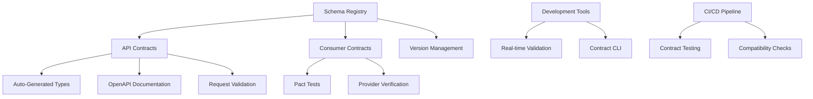

# Design Document

## Overview

The Contract-Driven Development feature transforms the Claude Code Task Manager into a contract-first system by extending the existing Zod-based validation architecture. This design leverages the current NestJS + Zod foundation to create a comprehensive contract ecosystem that includes automatic OpenAPI generation, type-safe client generation, consumer-driven contract testing, and real-time validation.

The implementation builds upon the existing `TaskExecutionRequestSchema`, `ClaudeCodeOptionsSchema`, and structured error handling patterns, extending them into a full contract-driven architecture that serves as the single source of truth for all system interfaces.

## Steering Document Alignment

### Technical Standards (tech.md)

The design follows the established technical patterns:

- **NestJS 10+ Framework**: Leverages existing modular architecture with dependency injection
- **Zod Schema Validation**: Extends current schema-first approach as single source of truth
- **TypeScript 5.0+ Strict Mode**: Maintains maximum type safety with generated types
- **Modular Design Principles**: Each contract component handles one specific domain
- **OpenAPI 3.0 Integration**: Auto-generation from existing Zod schemas

### Project Structure (structure.md)

Implementation follows established conventions:

- **Contract definitions** in `src/contracts/` following domain separation
- **Generated types** in `packages/types/src/generated/`
- **Contract tests** in `src/contracts/tests/` using existing testing patterns
- **API documentation** served via existing NestJS infrastructure
- **Validation pipes** extending current Zod validation architecture

## Code Reuse Analysis

### Existing Components to Leverage

- **Zod Schemas**: `TaskExecutionRequestSchema`, `ClaudeCodeOptionsSchema`, `ClaudeCodeEventSchema` as foundation patterns
- **NestJS Architecture**: Existing module structure, dependency injection, and decorator patterns
- **Error Handling**: Current `StructuredError` interface and error response patterns
- **Event System**: Existing `EventEmitter2` infrastructure for contract violation events
- **Validation Infrastructure**: Current Zod validation patterns in `validateTaskExecutionRequest`

### Integration Points

- **Worker Service**: Extend existing task execution contracts for comprehensive validation
- **Claude Code Client**: Enhance existing response parsing with contract verification
- **Database Models**: Integrate with existing Prisma schemas for contract storage
- **WebSocket Gateway**: Add contract validation to real-time communication
- **Testing Infrastructure**: Build on existing Jest and integration test patterns

## Architecture

The contract-driven architecture implements a layered approach where contracts serve as the interface definition between all system components:



### Modular Design Principles

- **Contract Registry**: Centralized schema management with version control
- **Validation Layer**: Isolated contract validation logic separate from business logic
- **Type Generation**: Automated TypeScript type creation from contracts
- **Testing Framework**: Consumer-driven contract testing infrastructure
- **Documentation Engine**: Auto-generated API documentation from contracts

## Components and Interfaces

### ContractRegistry

- **Purpose:** Centralized management of all system contracts with versioning
- **Interfaces:**
  - `registerContract(name: string, schema: ZodSchema, version: string): void`
  - `getContract(name: string, version?: string): ContractDefinition`
  - `validateCompatibility(oldSchema: ZodSchema, newSchema: ZodSchema): CompatibilityReport`
- **Dependencies:** Zod, versioning utilities
- **Reuses:** Existing schema validation patterns from `worker.config.ts`

### ApiContractGenerator

- **Purpose:** Generates OpenAPI specifications from Zod schemas
- **Interfaces:**
  - `generateOpenAPI(contracts: ContractDefinition[]): OpenAPISpec`
  - `generateEndpointDoc(schema: ZodSchema, metadata: EndpointMetadata): PathItem`
- **Dependencies:** Zod-to-OpenAPI converter, NestJS metadata
- **Reuses:** Existing schema patterns and NestJS decorator architecture

### TypeScriptGenerator

- **Purpose:** Generates TypeScript types and client code from contracts
- **Interfaces:**
  - `generateTypes(contracts: ContractDefinition[]): string`
  - `generateApiClient(openApiSpec: OpenAPISpec): string`
- **Dependencies:** TypeScript compiler API, code generation utilities
- **Reuses:** Current TypeScript configuration and build patterns

### ContractValidationPipe

- **Purpose:** NestJS pipe for contract-based request validation
- **Interfaces:**
  - `transform(value: any, metadata: ArgumentMetadata): any`
  - `validateContract(data: any, contractName: string): ValidationResult`
- **Dependencies:** NestJS pipes, Zod validation
- **Reuses:** Existing validation patterns from current Zod implementation

### PactTestRunner

- **Purpose:** Consumer-driven contract testing for external integrations
- **Interfaces:**
  - `createConsumerTest(contract: ConsumerContract): TestDefinition`
  - `verifyProviderContract(contract: ProviderContract): VerificationResult`
- **Dependencies:** Pact.js, existing test infrastructure
- **Reuses:** Current Jest test patterns and Claude Code client architecture

### ContractCLI

- **Purpose:** Command-line tools for contract management and validation
- **Interfaces:**
  - `generateDocs(): void`
  - `validateContracts(): ValidationReport`
  - `checkCompatibility(oldVersion: string, newVersion: string): CompatibilityReport`
- **Dependencies:** CLI framework, contract registry
- **Reuses:** Existing script patterns from `scripts/` directory

## Data Models

### ContractDefinition
```typescript
interface ContractDefinition {
  name: string;
  version: string;
  schema: ZodSchema;
  metadata: {
    description: string;
    tags: string[];
    deprecated?: boolean;
    successor?: string;
  };
  endpoints?: EndpointMetadata[];
  createdAt: Date;
  modifiedAt: Date;
}
```

### EndpointMetadata
```typescript
interface EndpointMetadata {
  path: string;
  method: HttpMethod;
  operationId: string;
  summary: string;
  description?: string;
  requestSchema?: string; // Reference to contract name
  responseSchema?: string; // Reference to contract name
  tags: string[];
}
```

### ValidationResult
```typescript
interface ValidationResult {
  valid: boolean;
  errors: ValidationError[];
  contract: string;
  timestamp: Date;
}

interface ValidationError {
  field: string;
  message: string;
  code: string;
  value: any;
}
```

### ConsumerContract
```typescript
interface ConsumerContract {
  consumer: string;
  provider: string;
  interactions: PactInteraction[];
  metadata: {
    pactSpecification: { version: string };
    client: { name: string; version: string };
  };
}
```

### CompatibilityReport
```typescript
interface CompatibilityReport {
  compatible: boolean;
  breakingChanges: BreakingChange[];
  warnings: CompatibilityWarning[];
  summary: {
    addedFields: number;
    removedFields: number;
    modifiedFields: number;
  };
}
```

## Error Handling

### Error Scenarios

1. **Contract Validation Failure**
   - **Handling:** Return structured error response with field-level details using existing `StructuredError` interface
   - **User Impact:** Clear error messages indicating specific validation failures with suggested corrections

2. **Contract Version Incompatibility**
   - **Handling:** Build-time failure with detailed compatibility report, preventing deployment
   - **User Impact:** Development-time feedback with migration guidance for breaking changes

3. **OpenAPI Generation Failure**
   - **Handling:** Build process failure with schema validation errors and correction suggestions
   - **User Impact:** Clear indication of which schemas have issues and how to fix them

4. **Consumer Contract Test Failure**
   - **Handling:** CI/CD pipeline failure with detailed test results showing contract violations
   - **User Impact:** Actionable test reports indicating specific integration failures and remediation steps

5. **Real-time Validation Error**
   - **Handling:** Development server warnings with hot-reload support for immediate feedback
   - **User Impact:** Instant feedback in development console with suggested fixes

## Testing Strategy

### Unit Testing

- **Contract Registry Tests**: Validate schema registration, versioning, and retrieval
- **Type Generation Tests**: Verify TypeScript type accuracy and compilation
- **Validation Pipe Tests**: Test contract validation logic and error handling
- **CLI Tool Tests**: Validate command-line interface functionality and output

### Integration Testing

- **API Contract Tests**: End-to-end testing of contract-validated endpoints
- **OpenAPI Generation Tests**: Verify complete documentation generation from schemas
- **Development Workflow Tests**: Test hot-reload and real-time validation features
- **Database Integration Tests**: Validate contract storage and retrieval

### End-to-End Testing

- **Consumer-Driven Contract Tests**: Full Pact testing workflow for Claude Code SDK integration
- **CI/CD Pipeline Tests**: Complete contract validation workflow in build pipeline
- **Documentation Generation Tests**: Full OpenAPI documentation generation and serving
- **Version Compatibility Tests**: Cross-version contract compatibility validation

### Contract Testing Framework

The implementation includes a comprehensive contract testing framework:

```typescript
// Example consumer test for Claude Code integration
describe('Claude Code Worker Contract', () => {
  it('should execute task according to contract', async () => {
    await provider
      .given('Claude Code SDK is available')
      .uponReceiving('a task execution request')
      .withRequest({
        method: 'POST',
        path: '/api/tasks/execute',
        headers: { 'Content-Type': 'application/json' },
        body: like({
          id: 'task-123',
          prompt: 'Create a React component',
          sessionName: 'web-dev',
          workingDirectory: '/project',
          options: { model: 'claude-3-sonnet' }
        })
      })
      .willRespondWith({
        status: 200,
        headers: { 'Content-Type': 'application/json' },
        body: like({
          taskId: 'task-123',
          success: true,
          state: 'COMPLETED',
          correlationId: string(),
          startTime: iso8601DateTime(),
          endTime: iso8601DateTime()
        })
      });

    const result = await workerService.executeTask(taskRequest);
    expect(result.success).toBe(true);
  });
});
```

This comprehensive design ensures 100% contract-driven development while seamlessly integrating with the existing NestJS + Zod architecture, providing enterprise-grade API contracts, automatic documentation, and bulletproof integration testing.