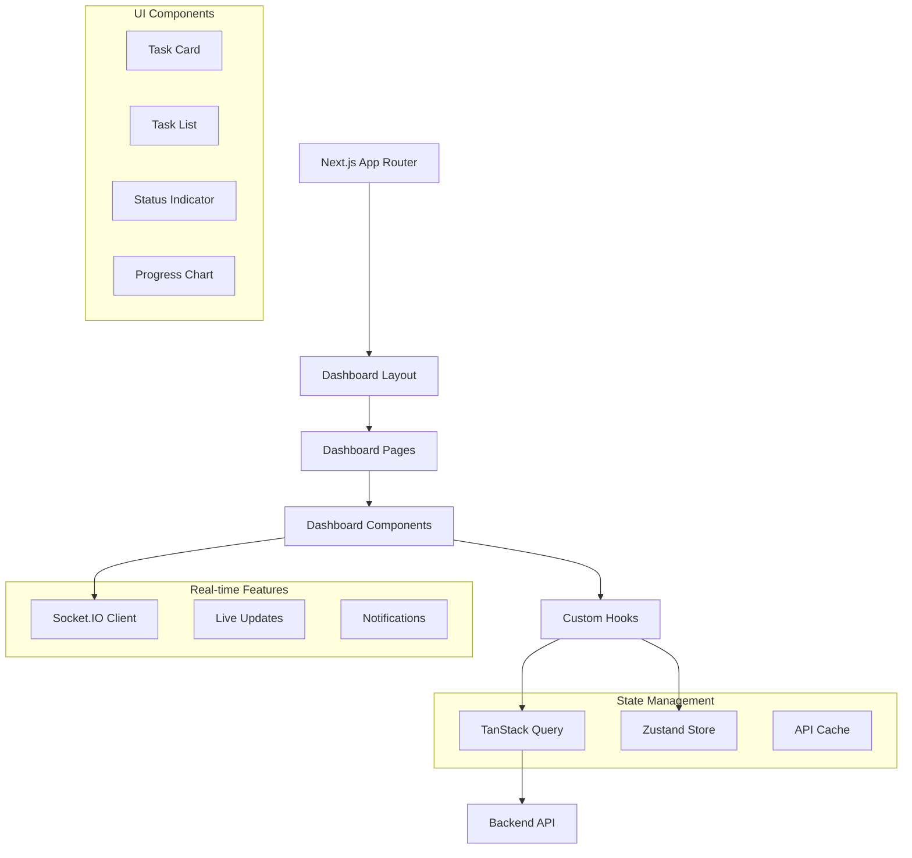

# Design Document

## Overview

The Dashboard Frontend design provides a modern, responsive React-based interface built with Next.js 14+ and the App Router for optimal performance and user experience. This design implements real-time task monitoring, intuitive task management, and comprehensive system visibility using shadcn/ui components, Tailwind CSS, and TanStack Query for efficient state management.

## Steering Document Alignment

### Technical Standards (tech.md)
- **Next.js 14+**: React framework with App Router for server-side rendering and full-stack capabilities
- **Shadcn/ui**: Component library providing code ownership and full customization control
- **Tailwind CSS**: Utility-first CSS framework optimized for AI code generation
- **TanStack Query**: Server state management with caching and background refetching

### Project Structure (structure.md)
- **App Directory**: `apps/frontend/src/app/dashboard/` for dashboard pages
- **Components**: `apps/frontend/src/components/dashboard/` for dashboard-specific components
- **Stores**: `apps/frontend/src/stores/` for Zustand client state management
- **Hooks**: `apps/frontend/src/hooks/` for custom React hooks

## Code Reuse Analysis

### Existing Components to Leverage
- **UI Components**: Extend existing shadcn/ui component library
- **Layout System**: Build upon existing Next.js app structure and routing
- **Auth Integration**: Utilize existing authentication patterns and JWT handling
- **API Client**: Extend existing HTTP client configuration and error handling

### Integration Points
- **Backend APIs**: Consume task CRUD endpoints with type-safe integration
- **WebSocket Events**: Real-time updates via Socket.IO client integration
- **Shared Types**: Utilize TypeScript types from shared packages
- **Theme System**: Integrate with existing design system and theme configuration

## Architecture

The frontend follows a component-driven architecture with clear separation of concerns and efficient state management:



### Modular Design Principles
- **Single File Responsibility**: Each component handles one specific UI concern
- **Component Isolation**: Pure components with clear prop interfaces and minimal side effects
- **Service Layer Separation**: API logic separated from UI components through custom hooks
- **Utility Modularity**: Shared utilities for formatting, validation, and common operations

## Components and Interfaces

### Dashboard Layout
- **Purpose:** Consistent layout structure with navigation, sidebar, and content areas
- **Interfaces:** Responsive layout with mobile-first design and accessibility features
- **Dependencies:** Next.js layout system, theme provider, authentication context
- **Reuses:** Existing layout patterns, navigation components, responsive utilities

### TaskCard Component
- **Purpose:** Individual task display with status, progress, and action controls
- **Interfaces:** Task data props with real-time updates and user interaction handlers
- **Dependencies:** Task types, status indicators, progress components
- **Reuses:** Existing card components, button patterns, icon system

### TaskList Component
- **Purpose:** Efficient list rendering with pagination, filtering, and sorting
- **Interfaces:** Task collection with infinite scroll and virtual scrolling support
- **Dependencies:** TaskCard components, pagination utilities, filtering logic
- **Reuses:** Existing list patterns, infinite scroll hooks, performance optimizations

### StatusIndicator Component
- **Purpose:** Real-time status visualization with color coding and animations
- **Interfaces:** Status enum props with transition animations and accessibility labels
- **Dependencies:** Status type definitions, animation utilities, theme colors
- **Reuses:** Existing status patterns, animation system, accessibility helpers

### ProgressChart Component
- **Purpose:** Task progress visualization with charts and metrics displays
- **Interfaces:** Progress data with responsive chart rendering and interactive features
- **Dependencies:** Chart library integration, data transformation utilities
- **Reuses:** Existing chart patterns, responsive utilities, data formatting

## Data Models

### Frontend State Management
```typescript
// Task state interface
export interface TaskState {
  tasks: Task[];
  selectedTask: Task | null;
  filters: TaskFilters;
  sorting: TaskSorting;
  pagination: PaginationState;
  loading: boolean;
  error: string | null;
}

// Task filters
export interface TaskFilters {
  status: TaskStatus[];
  priority: TaskPriority[];
  projectId: string | null;
  dateRange: {
    start: Date | null;
    end: Date | null;
  };
  search: string;
}

// Real-time updates
export interface LiveUpdate {
  type: 'task_created' | 'task_updated' | 'task_progress' | 'task_completed';
  taskId: string;
  data: Partial<Task>;
  timestamp: Date;
}
```

### Component Props Interfaces
```typescript
// TaskCard props
export interface TaskCardProps {
  task: Task;
  onSelect?: (task: Task) => void;
  onStart?: (taskId: string) => void;
  onCancel?: (taskId: string) => void;
  onViewDetails?: (taskId: string) => void;
  compact?: boolean;
  showActions?: boolean;
}

// TaskList props
export interface TaskListProps {
  tasks: Task[];
  loading?: boolean;
  error?: string | null;
  onTaskSelect?: (task: Task) => void;
  onLoadMore?: () => void;
  hasMore?: boolean;
  filters?: TaskFilters;
  onFiltersChange?: (filters: TaskFilters) => void;
}

// ProgressChart props
export interface ProgressChartProps {
  data: ProgressData[];
  timeRange: TimeRange;
  chartType: 'line' | 'bar' | 'area';
  showLegend?: boolean;
  height?: number;
  responsive?: boolean;
}
```

### API Integration Types
```typescript
// API query configuration
export interface TaskQueryConfig {
  enabled?: boolean;
  refetchInterval?: number;
  staleTime?: number;
  cacheTime?: number;
  retry?: number;
  refetchOnWindowFocus?: boolean;
}

// WebSocket event handlers
export interface WebSocketHandlers {
  onTaskCreated: (task: Task) => void;
  onTaskUpdated: (update: TaskUpdate) => void;
  onTaskProgress: (progress: TaskProgress) => void;
  onTaskCompleted: (result: TaskResult) => void;
  onSystemStatus: (status: SystemStatus) => void;
}
```

## Error Handling

### Error Scenarios
1. **Network Connection Failures**
   - **Handling:** Offline detection with cached data display and retry mechanisms
   - **User Impact:** Clear offline indicators with automatic sync when connection returns

2. **API Response Errors**
   - **Handling:** Error boundary components with graceful fallbacks and retry options
   - **User Impact:** User-friendly error messages with actionable recovery steps

3. **WebSocket Disconnections**
   - **Handling:** Automatic reconnection with exponential backoff and connection status display
   - **User Impact:** Connection status indicators with manual reconnect options

4. **Rendering Errors**
   - **Handling:** React error boundaries with error reporting and component isolation
   - **User Impact:** Partial page functionality maintained with error reporting options

5. **Performance Issues**
   - **Handling:** Performance monitoring with lazy loading and virtual scrolling
   - **User Impact:** Smooth interactions with loading states and performance optimizations

## Testing Strategy

### Unit Testing
- Component rendering testing with React Testing Library
- Custom hook testing with hook testing utilities
- State management testing with mock stores
- Utility function testing with comprehensive edge cases

### Integration Testing
- API integration testing with MSW (Mock Service Worker)
- WebSocket integration testing with mock Socket.IO server
- User interaction testing with user event simulation
- Responsive design testing with viewport testing

### End-to-End Testing
- Complete user workflow testing with Playwright
- Real-time feature testing with WebSocket connections
- Cross-browser compatibility testing
- Performance testing with Lighthouse metrics
- Accessibility testing with automated and manual validation