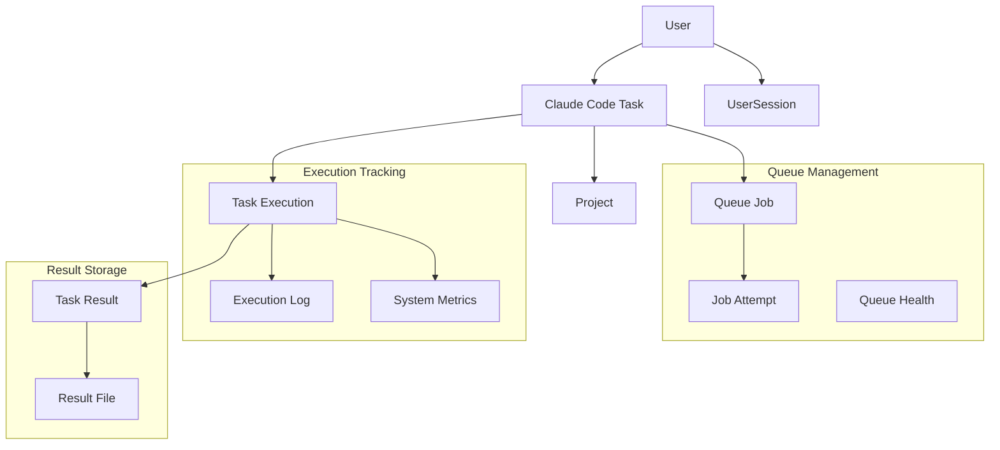

# Design Document

## Overview

The Database Schema Completion design extends the existing Prisma schema with comprehensive entities for Claude Code task management, execution tracking, queue state persistence, and system monitoring. This design builds upon the current User, Task, and Project models while adding sophisticated AI task execution capabilities, real-time monitoring, and enterprise-grade reliability features.

## Steering Document Alignment

### Technical Standards (tech.md)
- **Prisma ORM**: Type-safe database operations with auto-generated TypeScript types
- **PostgreSQL**: ACID compliance and data integrity with JSONB support for flexible data structures
- **Type Safety**: Generated TypeScript interfaces provide IntelliSense and compile-time validation
- **Migration Strategy**: Schema-first approach with reversible migrations for production safety

### Project Structure (structure.md)
- **Database Location**: `apps/backend/prisma/schema.prisma` (existing structure)
- **Migration Files**: `apps/backend/prisma/migrations/` (following established pattern)
- **Generated Types**: Output to `apps/backend/node_modules/.prisma/client` (existing config)
- **Repository Pattern**: Database layer isolated from business logic

## Code Reuse Analysis

### Existing Components to Leverage
- **User Model**: Extend existing authentication and user management foundation
- **Task Model**: Transform from basic task tracking to Claude Code AI task execution
- **Session Management**: Build upon UserSession for process and execution tracking
- **Project Organization**: Leverage existing project structure for task grouping

### Integration Points
- **Auth System**: Claude Code tasks inherit user ownership and permission models
- **Task Lifecycle**: Existing task status flow enhanced with AI execution states
- **Database Configuration**: Utilize existing PostgreSQL setup and connection management
- **Type Generation**: Extend current Prisma type generation for new entities

## Architecture

The database schema follows a domain-driven design with clear entity relationships supporting the Claude Code Task Manager's core workflows:



### Modular Design Principles
- **Single File Responsibility**: Each entity represents one business domain with clear boundaries
- **Component Isolation**: Queue, execution, monitoring, and result domains are separate but connected
- **Service Layer Separation**: Database entities support repository pattern implementation
- **Utility Modularity**: Shared enums and types provide consistency across domains

## Components and Interfaces

### ClaudeTask Entity
- **Purpose:** Extended task model specifically for Claude Code AI task execution
- **Interfaces:** CRUD operations, status tracking, execution lifecycle management
- **Dependencies:** User (creator), Project (organization), QueueJob (processing)
- **Reuses:** Existing Task model patterns, user relationships, timestamp conventions

### TaskExecution Entity
- **Purpose:** Tracks individual execution attempts with complete lifecycle metadata
- **Interfaces:** Real-time status updates, progress tracking, resource monitoring
- **Dependencies:** ClaudeTask (parent), User (executor), execution environment data
- **Reuses:** Existing timestamp patterns, relationship conventions

### QueueJob & JobAttempt Entities
- **Purpose:** Persistent queue state for BullMQ integration and retry tracking
- **Interfaces:** Queue manipulation, retry logic, distributed processing coordination
- **Dependencies:** ClaudeTask (work definition), execution environment configuration
- **Reuses:** Existing enum patterns, indexing strategies, foreign key conventions

### SystemMetric Entity
- **Purpose:** Time-series system performance and health monitoring data
- **Interfaces:** Metrics aggregation, performance analysis, trend reporting
- **Dependencies:** TaskExecution (context), system monitoring infrastructure
- **Reuses:** Timestamp patterns, indexing for performance queries

### ExecutionLog Entity
- **Purpose:** Structured log storage for Claude Code STDIO output and system events
- **Interfaces:** Log streaming, search and filtering, retention management
- **Dependencies:** TaskExecution (context), structured logging format
- **Reuses:** JSONB patterns for flexible log data, indexing for performance

## Data Models

### ClaudeTask (extends existing Task concept)
```prisma
model ClaudeTask {
  id            String      @id @default(uuid())
  title         String
  description   String?
  prompt        String      // Claude Code prompt/command
  config        Json?       // Task configuration (timeout, retry, etc.)
  status        ClaudeTaskStatus @default(PENDING)
  priority      TaskPriority @default(MEDIUM)

  // Relationships
  createdById   String      @map("created_by_id")
  createdBy     User        @relation("ClaudeTaskCreator", fields: [createdById], references: [id])
  projectId     String?     @map("project_id")
  project       Project?    @relation(fields: [projectId], references: [id])

  // Execution tracking
  executions    TaskExecution[]
  queueJobs     QueueJob[]
  results       TaskResult[]

  // Metadata
  tags          String[]
  estimatedDuration Int?    @map("estimated_duration") // seconds
  actualDuration    Int?    @map("actual_duration")    // seconds

  // Timestamps
  createdAt     DateTime    @default(now()) @map("created_at")
  updatedAt     DateTime    @updatedAt @map("updated_at")
  scheduledAt   DateTime?   @map("scheduled_at")
  startedAt     DateTime?   @map("started_at")
  completedAt   DateTime?   @map("completed_at")

  @@map("claude_tasks")
  @@index([status])
  @@index([priority])
  @@index([createdById])
  @@index([scheduledAt])
}
```

### TaskExecution
```prisma
model TaskExecution {
  id              String        @id @default(uuid())
  taskId          String        @map("task_id")
  task            ClaudeTask    @relation(fields: [taskId], references: [id], onDelete: Cascade)

  // Execution metadata
  status          ExecutionStatus @default(INITIALIZING)
  progress        Float?        @default(0.0) // 0.0 to 1.0
  workerId        String?       @map("worker_id")
  processId       String?       @map("process_id")
  sessionId       String?       @map("session_id") // Claude Code session

  // Resource tracking
  cpuUsage        Float?        @map("cpu_usage")
  memoryUsage     Int?          @map("memory_usage") // bytes
  diskUsage       Int?          @map("disk_usage")   // bytes

  // Error handling
  errorMessage    String?       @map("error_message")
  errorCode       String?       @map("error_code")
  stackTrace      String?       @map("stack_trace")
  retryCount      Int           @default(0) @map("retry_count")

  // Relationships
  logs            ExecutionLog[]
  metrics         SystemMetric[]

  // Timestamps
  createdAt       DateTime      @default(now()) @map("created_at")
  startedAt       DateTime?     @map("started_at")
  completedAt     DateTime?     @map("completed_at")
  lastHeartbeat   DateTime?     @map("last_heartbeat")

  @@map("task_executions")
  @@index([taskId])
  @@index([status])
  @@index([workerId])
  @@index([startedAt])
}
```

### QueueJob (BullMQ persistence)
```prisma
model QueueJob {
  id              String        @id @default(uuid())
  taskId          String        @map("task_id")
  task            ClaudeTask    @relation(fields: [taskId], references: [id], onDelete: Cascade)

  // Queue metadata
  queueName       String        @map("queue_name")
  jobId           String        @unique @map("job_id") // BullMQ job ID
  status          QueueJobStatus @default(WAITING)
  priority        Int           @default(0)
  delay           Int?          @default(0) // milliseconds

  // Processing
  attempts        JobAttempt[]
  maxAttempts     Int           @default(3) @map("max_attempts")
  backoffType     BackoffType   @default(EXPONENTIAL) @map("backoff_type")
  backoffDelay    Int           @default(2000) @map("backoff_delay") // milliseconds

  // Data
  jobData         Json          @map("job_data")
  jobOptions      Json?         @map("job_options")
  result          Json?

  // Timestamps
  createdAt       DateTime      @default(now()) @map("created_at")
  processedAt     DateTime?     @map("processed_at")
  finishedAt      DateTime?     @map("finished_at")

  @@map("queue_jobs")
  @@index([queueName])
  @@index([status])
  @@index([priority])
  @@index([createdAt])
}
```

### ExecutionLog
```prisma
model ExecutionLog {
  id              String        @id @default(uuid())
  executionId     String        @map("execution_id")
  execution       TaskExecution @relation(fields: [executionId], references: [id], onDelete: Cascade)

  // Log metadata
  level           LogLevel      @default(INFO)
  source          LogSource     @default(SYSTEM)
  message         String
  details         Json?         // Structured log data

  // Context
  component       String?       // Which component generated the log
  operation       String?       // What operation was being performed
  correlationId   String?       @map("correlation_id")

  // Timestamps
  timestamp       DateTime      @default(now())

  @@map("execution_logs")
  @@index([executionId])
  @@index([level])
  @@index([source])
  @@index([timestamp])
  @@index([correlationId])
}
```

### SystemMetric
```prisma
model SystemMetric {
  id              String        @id @default(uuid())
  executionId     String?       @map("execution_id")
  execution       TaskExecution? @relation(fields: [executionId], references: [id], onDelete: Cascade)

  // Metric metadata
  metricType      MetricType
  metricName      String        @map("metric_name")
  value           Float
  unit            String?

  // Context
  workerId        String?       @map("worker_id")
  queueName       String?       @map("queue_name")
  tags            Json?         // Additional metric tags

  // Timestamps
  timestamp       DateTime      @default(now())

  @@map("system_metrics")
  @@index([metricType])
  @@index([metricName])
  @@index([timestamp])
  @@index([workerId])
  @@index([executionId])
}
```

### TaskResult
```prisma
model TaskResult {
  id              String        @id @default(uuid())
  taskId          String        @map("task_id")
  task            ClaudeTask    @relation(fields: [taskId], references: [id], onDelete: Cascade)

  // Result metadata
  status          ResultStatus  @default(SUCCESS)
  summary         String?
  output          Json?         // Structured output data

  // File attachments
  files           ResultFile[]

  // Quality metrics
  executionTime   Int?          @map("execution_time") // milliseconds
  tokensUsed      Int?          @map("tokens_used")
  costEstimate    Float?        @map("cost_estimate")

  // Timestamps
  createdAt       DateTime      @default(now()) @map("created_at")

  @@map("task_results")
  @@index([taskId])
  @@index([status])
  @@index([createdAt])
}
```

## Error Handling

### Error Scenarios
1. **Database Connection Failures**
   - **Handling:** Connection pooling with automatic retry and circuit breaker patterns
   - **User Impact:** Graceful degradation with cached data, clear error messages

2. **Migration Failures**
   - **Handling:** Atomic transactions with automatic rollback, backup verification
   - **User Impact:** Zero downtime deployments, data integrity preservation

3. **Constraint Violations**
   - **Handling:** Comprehensive validation at application layer before database operations
   - **User Impact:** Clear validation error messages with field-specific guidance

4. **Query Performance Issues**
   - **Handling:** Comprehensive indexing strategy, query optimization, monitoring
   - **User Impact:** Sub-50ms query response times maintained under load

## Testing Strategy

### Unit Testing
- Entity validation and constraint testing
- Relationship integrity verification
- Index performance testing
- Migration script validation

### Integration Testing
- Cross-entity relationship testing
- Transaction boundary verification
- Concurrent access testing
- Database connection pooling

### End-to-End Testing
- Complete task lifecycle data flow
- Real-time data synchronization
- Performance testing under load
- Data migration and backup recovery