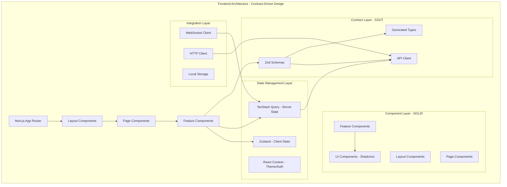
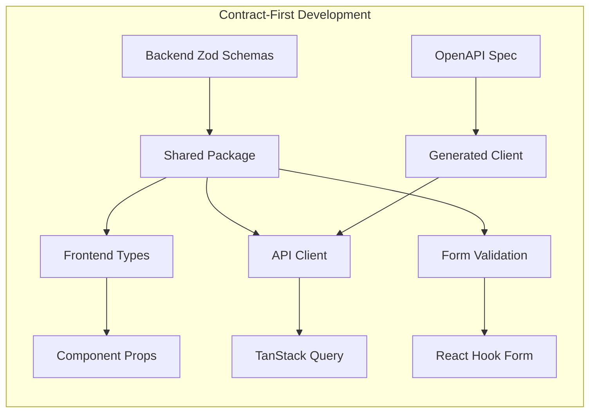

# Design Document

## Overview

The Claude Code Task Manager frontend is a contract-driven, type-safe Next.js 14+ application implementing modern React patterns with industry-standard libraries. Built on SOLID principles, the application serves as a comprehensive dashboard for AI task management, featuring real-time monitoring, responsive design, and seamless backend integration through Zod-based contract validation. The architecture emphasizes Single Source of Truth (SSOT) through shared schemas, Single Level of Abstraction Principle (SLAP) in component design, and Keep It Simple, Stupid (KISS) methodology for maintainable, scalable code.

## Steering Document Alignment

### Technical Standards (tech.md)

The frontend implementation aligns with documented technical patterns by:
- **Next.js 14+ App Router**: Utilizing React Server Components (RSC) for optimal performance and SEO capabilities
- **TypeScript 5.0+ Strict Mode**: Ensuring maximum type safety across all components and business logic
- **Shadcn/ui Component Library**: Providing code ownership and full customization control as specified in tech standards
- **TanStack Query + Zustand**: Following the approved state management pattern separating server and client state
- **Contract-Driven Development**: Implementing Zod schemas as SSOT for all API communication and validation

### Project Structure (structure.md)

The implementation follows project organization conventions through:
- **Apps Directory Pattern**: Located at `apps/frontend/` following the established monorepo structure
- **Feature-Based Organization**: Components organized by domain (tasks, auth, dashboard) matching backend module boundaries
- **Shared Package Integration**: Consuming `@cc-task-manager/schemas` and `@cc-task-manager/types` for contract-driven development
- **Import Pattern Compliance**: Following the documented import order and module organization standards
- **Component Size Guidelines**: Adhering to maximum file sizes and complexity limits as defined in structure.md

## Code Reuse Analysis

The frontend leverages existing infrastructure and extends proven patterns from the current codebase while maintaining contract-driven development principles.

### Existing Components to Leverage

- **@cc-task-manager/schemas**: Extended with frontend-specific Zod schemas for form validation, component props, and state management
- **@cc-task-manager/types**: Leveraged for shared TypeScript interfaces ensuring type consistency across frontend and backend
- **Package.json Workspace Configuration**: Utilizing existing npm workspace setup for dependency management and build optimization
- **Prisma Database Schema**: Referenced for understanding data relationships and implementing corresponding UI components
- **BullMQ Job Schemas**: Used for task creation forms and status display components ensuring data contract compliance

### Integration Points

- **Backend API Contracts**: Direct integration with NestJS backend through OpenAPI-generated client using shared Zod schemas
- **WebSocket Gateway**: Real-time connection to Socket.IO backend for live task updates and system notifications
- **Authentication System**: JWT token integration with backend Passport.js authentication following established security patterns
- **Database Entity Mapping**: UI components directly map to Prisma entities ensuring data model consistency and SOLID principle adherence

## Architecture

The frontend architecture implements a layered, contract-driven design following SOLID principles and industry-standard React patterns. Each layer maintains clear separation of concerns while ensuring type safety through Zod schema validation.

### Modular Design Principles

- **Single File Responsibility**: Each component file handles one specific UI concern or business domain (SRP)
- **Component Isolation**: Small, focused components using composition over inheritance following Open/Closed Principle
- **Service Layer Separation**: API client, state management, and UI components operate independently following Dependency Inversion Principle
- **Utility Modularity**: Focused, single-purpose hooks and utilities ensuring Interface Segregation Principle adherence



### Contract-Driven Architecture Flow



## Components and Interfaces

### Task Management Components

**Purpose:** Comprehensive task lifecycle management following Single Responsibility Principle
**Interfaces:**
- `TaskListProps`: Pagination, filtering, and sorting configuration
- `TaskCardProps`: Individual task display and interaction handlers
- `TaskCreateFormProps`: Task creation with Zod schema validation

**Dependencies:**
- `@cc-task-manager/schemas/TaskSchema` for validation
- `TanStack Query` for server state management
- `Socket.IO client` for real-time updates

**Reuses:**
- Backend task schemas ensuring contract-driven validation
- Shared TypeScript types for data consistency
- Existing authentication context for permission checks

```typescript
// Contract-driven component interface
interface TaskCardProps {
  task: z.infer<typeof TaskSchema>;
  onStatusChange: (taskId: string, status: TaskStatus) => Promise<void>;
  permissions: z.infer<typeof UserPermissionsSchema>;
}

// SOLID principle implementation
const TaskCard: React.FC<TaskCardProps> = ({ task, onStatusChange, permissions }) => {
  // Single Responsibility: Only handles task display and basic interactions
  // Open/Closed: Extensible through props, closed for modification
  // Interface Segregation: Only requires necessary props
};
```

### Dashboard and Monitoring Components

**Purpose:** Real-time system monitoring and metrics visualization following SLAP and KISS principles
**Interfaces:**
- `DashboardProps`: Metrics configuration and refresh intervals
- `MetricsCardProps`: Individual metric display with thresholds
- `ChartComponentProps`: Data visualization with responsive design

**Dependencies:**
- `Chart.js/React-Chartjs-2` for industry-standard data visualization
- `WebSocket client` for real-time metric updates
- `@cc-task-manager/types` for metric type definitions

**Reuses:**
- Backend monitoring schemas for consistent data structure
- Shared utility functions for date formatting and calculations
- Authentication hooks for role-based metric access

```typescript
// Industry-standard charting integration
interface MetricsChartProps {
  data: z.infer<typeof MetricsDataSchema>;
  config: ChartConfiguration;
  realTimeUpdate: boolean;
}

// SOLID implementation with dependency injection
const MetricsChart: React.FC<MetricsChartProps> = memo(({ data, config, realTimeUpdate }) => {
  // Liskov Substitution: Can replace any chart component
  // Dependency Inversion: Depends on abstract chart configuration
});
```

### Authentication and Session Components

**Purpose:** Secure user authentication and session management following security best practices
**Interfaces:**
- `LoginFormProps`: Authentication form with validation
- `AuthContextProps`: User session and permission state
- `ProtectedRouteProps`: Route-level authorization

**Dependencies:**
- `JWT token handling` with secure storage
- `React Hook Form + Zod` for type-safe form validation
- `Next.js middleware` for route protection

**Reuses:**
- Backend authentication schemas for login validation
- Shared JWT token utilities for consistent handling
- Permission schemas for role-based UI adaptation

```typescript
// Contract-driven authentication
const LoginSchema = z.object({
  email: z.string().email(),
  password: z.string().min(8),
});

interface AuthContextValue {
  user: z.infer<typeof UserSchema> | null;
  permissions: z.infer<typeof UserPermissionsSchema>;
  login: (credentials: z.infer<typeof LoginSchema>) => Promise<void>;
  logout: () => void;
}

// SOLID principle application in context provider
const AuthProvider: React.FC<PropsWithChildren> = ({ children }) => {
  // Single Responsibility: Only handles authentication state
  // Open/Closed: Extensible authentication methods without modification
};
```

## Data Models

### Frontend-Specific Zod Schemas

```typescript
// Contract-driven form validation extending backend schemas
const TaskCreateFormSchema = TaskSchema.pick({
  name: true,
  description: true,
  command: true,
  arguments: true,
  workingDirectory: true,
  timeout: true,
}).extend({
  // Frontend-specific validations
  clientValidation: z.boolean().default(true),
  optimisticUpdate: z.boolean().default(true),
});

// Component prop validation schemas
const TaskCardPropsSchema = z.object({
  task: TaskSchema,
  onEdit: z.function().args(z.string()).returns(z.void()),
  onDelete: z.function().args(z.string()).returns(z.promise(z.void())),
  permissions: UserPermissionsSchema,
});

// Real-time event schemas for WebSocket communication
const TaskUpdateEventSchema = z.object({
  type: z.literal('TASK_UPDATE'),
  payload: z.object({
    taskId: z.string(),
    status: TaskStatusSchema,
    progress: z.number().min(0).max(100).optional(),
    logs: z.array(z.string()).optional(),
  }),
});
```

### State Management Models

```typescript
// TanStack Query state management with Zod validation
interface TasksQueryState {
  tasks: z.infer<typeof TaskSchema>[];
  isLoading: boolean;
  error: Error | null;
  pagination: z.infer<typeof PaginationSchema>;
}

// Zustand client state with TypeScript strict typing
interface UIState {
  theme: 'light' | 'dark' | 'system';
  sidebarCollapsed: boolean;
  activeFilters: z.infer<typeof TaskFiltersSchema>;
  notifications: z.infer<typeof NotificationSchema>[];
}

// WebSocket connection state
interface WebSocketState {
  connected: boolean;
  reconnectAttempts: number;
  lastMessage: z.infer<typeof TaskUpdateEventSchema> | null;
  subscriptions: Set<string>;
}
```

## Error Handling

### Error Scenarios and Industry-Standard Solutions

1. **API Communication Failures**
   - **Handling:** Automatic retry with exponential backoff using TanStack Query's built-in retry mechanism
   - **User Impact:** Loading states with retry buttons, clear error messages, cached data fallback
   - **Implementation:** React Error Boundaries with graceful degradation following KISS principle

2. **WebSocket Connection Issues**
   - **Handling:** Automatic reconnection with connection status indicators, offline mode activation
   - **User Impact:** Connection status badge, buffered updates on reconnection, manual refresh option
   - **Implementation:** Custom hook managing connection state with exponential backoff strategy

3. **Form Validation Errors**
   - **Handling:** Real-time Zod schema validation with field-level and form-level error display
   - **User Impact:** Immediate feedback, clear error messages, guided correction suggestions
   - **Implementation:** React Hook Form integration with Zod resolver for contract-driven validation

4. **Authentication Token Expiration**
   - **Handling:** Automatic token refresh, secure storage management, graceful logout on failure
   - **User Impact:** Seamless session continuation, clear authentication state indicators
   - **Implementation:** Axios interceptors with token refresh logic and secure storage patterns

5. **Component Rendering Failures**
   - **Handling:** React Error Boundaries with fallback UI, error reporting to monitoring service
   - **User Impact:** Partial page functionality maintained, clear error reporting, recovery options
   - **Implementation:** Granular error boundaries following Single Responsibility Principle

```typescript
// Industry-standard error boundary implementation
class TaskErrorBoundary extends Component<PropsWithChildren> {
  state = { hasError: false, error: null };

  static getDerivedStateFromError(error: Error) {
    return { hasError: true, error };
  }

  componentDidCatch(error: Error, errorInfo: ErrorInfo) {
    // Error reporting service integration
    console.error('Task component error:', error, errorInfo);
  }

  render() {
    if (this.state.hasError) {
      return <TaskErrorFallback onRetry={() => this.setState({ hasError: false })} />;
    }
    return this.props.children;
  }
}
```

## Testing Strategy

### Contract-Driven Testing Approach

**Unit Testing with Zod Schema Validation:**
- Component prop validation using Zod schemas ensuring type safety
- Custom hook testing with mock data validated against schemas
- Utility function testing with schema-validated inputs and outputs
- Form validation testing using the same Zod schemas as production

**Integration Testing with API Contracts:**
- API client testing using shared backend schemas for request/response validation
- WebSocket integration testing with real-time event schema validation
- Authentication flow testing with JWT token handling and permission schemas
- End-to-end user workflows ensuring contract compliance throughout

**Visual and Accessibility Testing:**
- Storybook component documentation with Zod prop validation examples
- Chromatic visual regression testing for consistent UI across builds
- Accessibility testing using @testing-library/jest-dom and axe-core
- Responsive design testing across device sizes and orientations

```typescript
// Contract-driven testing example
describe('TaskCard Component', () => {
  it('should validate props using Zod schema', () => {
    const validProps = TaskCardPropsSchema.parse({
      task: mockTask,
      onEdit: jest.fn(),
      onDelete: jest.fn(),
      permissions: mockPermissions,
    });

    render(<TaskCard {...validProps} />);
    expect(screen.getByRole('article')).toBeInTheDocument();
  });

  it('should handle real-time updates following contract', async () => {
    const updateEvent = TaskUpdateEventSchema.parse({
      type: 'TASK_UPDATE',
      payload: { taskId: '123', status: 'completed' },
    });

    // Test WebSocket integration with schema validation
    mockWebSocket.emit('task-update', updateEvent);
    await waitFor(() => {
      expect(screen.getByText('completed')).toBeInTheDocument();
    });
  });
});
```

### Performance and Quality Assurance

**Performance Testing:**
- Lighthouse CI integration for Core Web Vitals monitoring
- Bundle size analysis with webpack-bundle-analyzer
- React DevTools Profiler for component render optimization
- Memory leak detection for long-running dashboard sessions

**Quality Assurance:**
- ESLint with TypeScript rules and accessibility plugins
- Prettier with Tailwind CSS plugin for consistent formatting
- Husky pre-commit hooks running lint, type check, and tests
- SonarQube integration for code quality metrics and security scanning

The testing strategy ensures contract compliance while maintaining high code quality and user experience standards through industry-standard tools and methodologies.