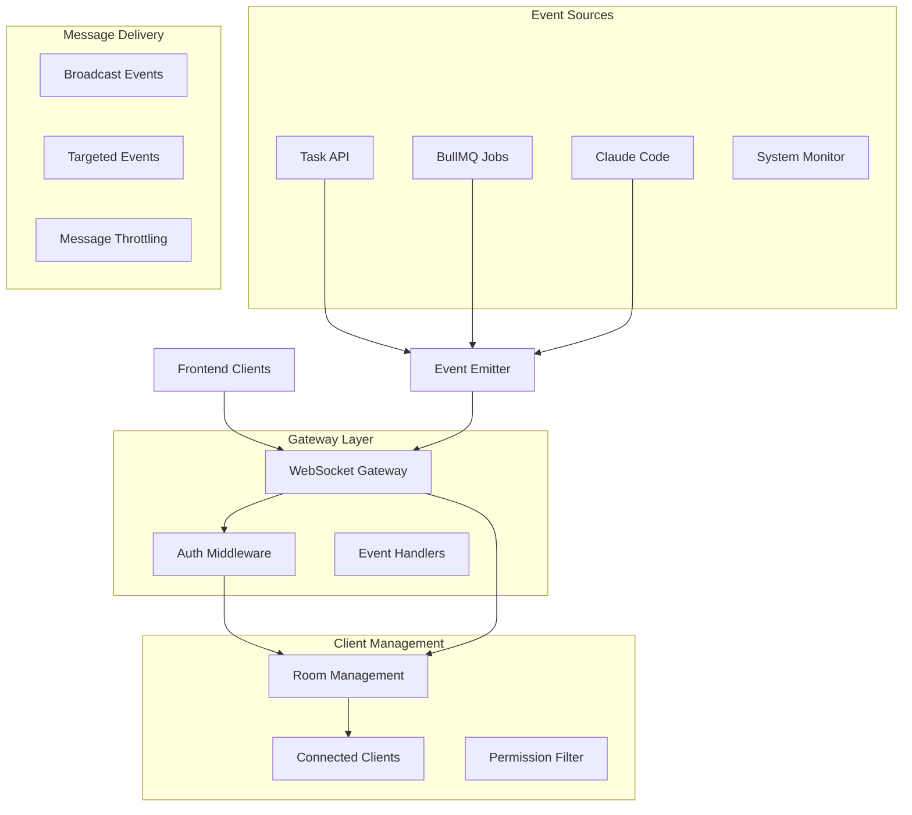

# Design Document

## Overview

The Real-time WebSocket Events design provides instant bidirectional communication using Socket.IO with NestJS Gateway integration for seamless real-time updates between the backend services and frontend dashboard. This design implements room-based targeting, automatic reconnection, structured event handling, and optimized message delivery to achieve sub-100ms update latency for superior user experience.

## Steering Document Alignment

### Technical Standards (tech.md)
- **Socket.IO**: Real-time WebSocket communication via NestJS Gateway for live updates
- **NestJS Gateway**: Structured WebSocket handling with dependency injection and guards
- **JWT Authentication**: Secure WebSocket connections with token-based authentication
- **TypeScript**: Type-safe event definitions and handler interfaces

### Project Structure (structure.md)
- **WebSocket Gateway**: `apps/backend/src/websocket/websocket.gateway.ts` for main gateway
- **Event Handlers**: `apps/backend/src/websocket/handlers/` for event-specific logic
- **Event Types**: `apps/backend/src/websocket/events/` for type definitions
- **Middleware**: `apps/backend/src/websocket/middleware/` for authentication and validation

## Code Reuse Analysis

### Existing Components to Leverage
- **WebSocket Module**: Extend existing `apps/backend/src/websocket/` infrastructure
- **Auth Guards**: Utilize existing JWT authentication and authorization patterns
- **Task Service**: Integrate with task management for event source generation
- **User Service**: Leverage user management for permission-based event filtering

### Integration Points
- **Task CRUD API**: Emit events for all task lifecycle changes
- **BullMQ Processor**: Stream job progress updates in real-time
- **Claude Code Integration**: Forward execution progress and log streaming
- **Dashboard Frontend**: Consume events for live UI updates

## Architecture

The WebSocket system follows an event-driven architecture with clear separation between event sources, gateway coordination, and client delivery:



### Modular Design Principles
- **Single File Responsibility**: Each event handler manages one specific event type
- **Component Isolation**: Gateway separated from business logic through event delegation
- **Service Layer Separation**: Clear boundaries between event generation, routing, and delivery
- **Utility Modularity**: Shared utilities for room management, authentication, and message formatting

## Components and Interfaces

### WebSocketGateway
- **Purpose:** Main Socket.IO gateway coordinating all real-time communication
- **Interfaces:** Socket.IO server interface with authentication and room management
- **Dependencies:** Auth services, event handlers, room management utilities
- **Reuses:** Existing gateway patterns, authentication middleware, connection management

### TaskEventHandler
- **Purpose:** Specialized handler for task lifecycle events with permission filtering
- **Interfaces:** Task event subscription with user-based filtering and room targeting
- **Dependencies:** Task service, user permissions, room management
- **Reuses:** Existing event patterns, permission checking, subscription management

### ProgressStreamHandler
- **Purpose:** Real-time progress streaming for task execution with live log forwarding
- **Interfaces:** Progress event streaming with buffering and throttling capabilities
- **Dependencies:** Execution monitoring, log streaming, message buffering
- **Reuses:** Existing streaming patterns, buffer management, rate limiting

### RoomManager
- **Purpose:** WebSocket room management with user-based permissions and dynamic subscriptions
- **Interfaces:** Room creation, user assignment, permission validation, cleanup operations
- **Dependencies:** User service, permission system, connection tracking
- **Reuses:** Existing room patterns, permission management, cleanup utilities

## Data Models

### Event Type Definitions
```typescript
// Base event interface
export interface BaseWebSocketEvent {
  type: string;
  timestamp: Date;
  userId?: string;
  metadata?: Record<string, any>;
}

// Task lifecycle events
export interface TaskCreatedEvent extends BaseWebSocketEvent {
  type: 'task_created';
  data: {
    task: Task;
    createdBy: User;
  };
}

export interface TaskUpdatedEvent extends BaseWebSocketEvent {
  type: 'task_updated';
  data: {
    taskId: string;
    changes: Partial<Task>;
    updatedBy: User;
  };
}

export interface TaskProgressEvent extends BaseWebSocketEvent {
  type: 'task_progress';
  data: {
    taskId: string;
    executionId: string;
    progress: number; // 0-1
    stage: string;
    message?: string;
    logs?: LogEntry[];
  };
}

// System events
export interface SystemStatusEvent extends BaseWebSocketEvent {
  type: 'system_status';
  data: {
    status: 'healthy' | 'degraded' | 'error';
    metrics: SystemMetrics;
    alerts?: Alert[];
  };
}
```

### Room and Subscription Management
```typescript
export interface RoomConfig {
  name: string;
  type: 'user' | 'project' | 'global';
  permissions: Permission[];
  maxClients?: number;
  ttl?: number; // time to live in seconds
}

export interface ClientSubscription {
  socketId: string;
  userId: string;
  rooms: string[];
  permissions: Permission[];
  subscribedEvents: EventType[];
  connectionTime: Date;
  lastActivity: Date;
}

export interface EventFilter {
  eventType: EventType;
  userId?: string;
  projectId?: string;
  permissions: Permission[];
  rateLimits?: {
    maxEvents: number;
    timeWindow: number; // seconds
  };
}
```

### Message Delivery Configuration
```typescript
export interface DeliveryConfig {
  compression: boolean;
  binaryMode: boolean;
  acknowledgment: boolean;
  timeout: number; // milliseconds
  retryAttempts: number;
  priorityLevels: {
    high: EventType[];
    normal: EventType[];
    low: EventType[];
  };
}

export interface ThrottlingConfig {
  globalRateLimit: {
    maxEvents: number;
    timeWindow: number;
  };
  perClientRateLimit: {
    maxEvents: number;
    timeWindow: number;
  };
  eventSpecificLimits: Map<EventType, {
    maxEvents: number;
    timeWindow: number;
  }>;
}
```

### Authentication and Authorization
```typescript
export interface WebSocketAuthPayload {
  token: string;
  deviceId?: string;
  clientVersion?: string;
}

export interface AuthenticatedClient {
  socketId: string;
  user: User;
  permissions: Permission[];
  deviceInfo?: DeviceInfo;
  connectionMetadata: {
    ipAddress: string;
    userAgent: string;
    connectedAt: Date;
  };
}
```

## Error Handling

### Error Scenarios
1. **Connection Authentication Failures**
   - **Handling:** JWT validation with clear error responses and reconnection guidance
   - **User Impact:** Authentication error display with login redirect and token refresh

2. **Message Delivery Failures**
   - **Handling:** Acknowledgment tracking with retry mechanisms and offline queuing
   - **User Impact:** Reliable message delivery with connection status indicators

3. **Rate Limit Violations**
   - **Handling:** Client-specific throttling with graceful degradation and priority messaging
   - **User Impact:** Smooth experience with intelligent message prioritization

4. **Room Permission Violations**
   - **Handling:** Permission validation with automatic room cleanup and access revocation
   - **User Impact:** Security enforcement with clear permission error messages

5. **Server Overload Conditions**
   - **Handling:** Connection limiting with load balancing and graceful degradation
   - **User Impact:** Stable service with queue status and estimated wait times

## Testing Strategy

### Unit Testing
- Event handler testing with mock Socket.IO instances
- Room management testing with permission scenarios
- Message throttling testing with rate limit simulation
- Authentication middleware testing with token validation

### Integration Testing
- Socket.IO gateway testing with real WebSocket connections
- Event emission testing with multiple client scenarios
- Permission filtering testing with user role combinations
- Message delivery testing with network simulation

### End-to-End Testing
- Complete real-time workflow testing from backend events to frontend updates
- Multi-client coordination testing with concurrent connections
- Network resilience testing with connection interruptions
- Performance testing under high message volume
- Security testing with authentication and authorization scenarios