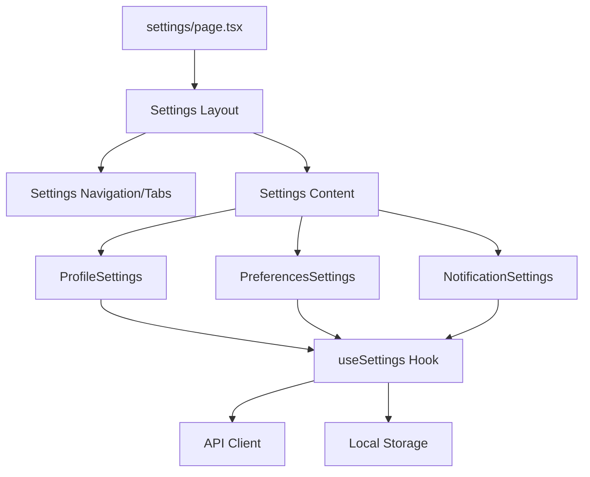

# Design Document - Settings Page

## Overview

Next.js page at /settings that provides user configuration interface with organized settings categories including profile, preferences, and notifications.

## Steering Document Alignment

### Technical Standards (tech.md)
- Next.js 14+ App Router
- TypeScript strict mode
- React Hook Form for form management
- Zod for validation

### Project Structure (structure.md)
- Page location: `apps/frontend/src/app/settings/page.tsx`
- Components:
  - `apps/frontend/src/components/settings/ProfileSettings.tsx`
  - `apps/frontend/src/components/settings/PreferencesSettings.tsx`
  - `apps/frontend/src/components/settings/NotificationSettings.tsx`
- Hooks: `apps/frontend/src/hooks/useSettings.ts`

## Code Reuse Analysis

### Existing Components to Leverage
- **Form components**: Input, Select, Switch from shadcn/ui
- **Card component**: For settings sections
- **Button component**: For actions and saves
- **Theme context**: For theme switching functionality

### Integration Points
- **API**: User profile and settings endpoints
- **Local storage**: For client-side preferences
- **Theme system**: For theme toggle integration
- **Auth context**: For user information

## Architecture



## Components and Interfaces

### SettingsPage Component
- **Purpose:** Page component for /settings route
- **Type:** React Server Component with client form components
- **Dependencies:** Settings section components, useSettings
- **Reuses:** Card, Tabs, Form components, page layout

### ProfileSettings Component
- **Purpose:** User profile configuration form
- **Props:**
  ```typescript
  interface ProfileSettingsProps {
    initialData: UserProfile;
    onSave: (data: UserProfile) => Promise<void>;
  }
  ```
- **Dependencies:** React Hook Form, Zod validation
- **Reuses:** Form components from shadcn/ui

### PreferencesSettings Component
- **Purpose:** Application preferences configuration
- **Props:**
  ```typescript
  interface PreferencesSettingsProps {
    initialData: AppPreferences;
    onSave: (data: AppPreferences) => Promise<void>;
  }
  ```
- **Dependencies:** Theme context, React Hook Form
- **Reuses:** Switch, Select components

### useSettings Hook
- **Purpose:** Manage settings state and persistence
- **Interface:**
  ```typescript
  function useSettings(): {
    settings: Settings;
    updateSettings: (settings: Partial<Settings>) => Promise<void>;
    isLoading: boolean;
    error: Error | null;
  }
  ```

## Data Models

### Settings Type
```typescript
interface Settings {
  profile: UserProfile;
  preferences: AppPreferences;
  notifications: NotificationSettings;
}

interface UserProfile {
  firstName: string;
  lastName: string;
  email: string;
  avatar?: string;
}

interface AppPreferences {
  theme: 'light' | 'dark' | 'system';
  language: string;
  dateFormat: string;
  timezone: string;
}

interface NotificationSettings {
  emailNotifications: boolean;
  pushNotifications: boolean;
  taskReminders: boolean;
}
```

## Error Handling

### Error Scenarios
1. **Validation Errors**
   - **Handling:** Display inline field errors
   - **User Impact:** Clear guidance on fixing input

2. **Save Failures**
   - **Handling:** Show error toast, don't lose user input
   - **User Impact:** Can retry without re-entering data

3. **Network Errors**
   - **Handling:** Offer offline mode or retry
   - **User Impact:** Graceful degradation

## Testing Strategy

- Unit test: Individual settings components and forms
- Integration test: Settings save and load correctly
- E2E test: Full settings configuration workflow