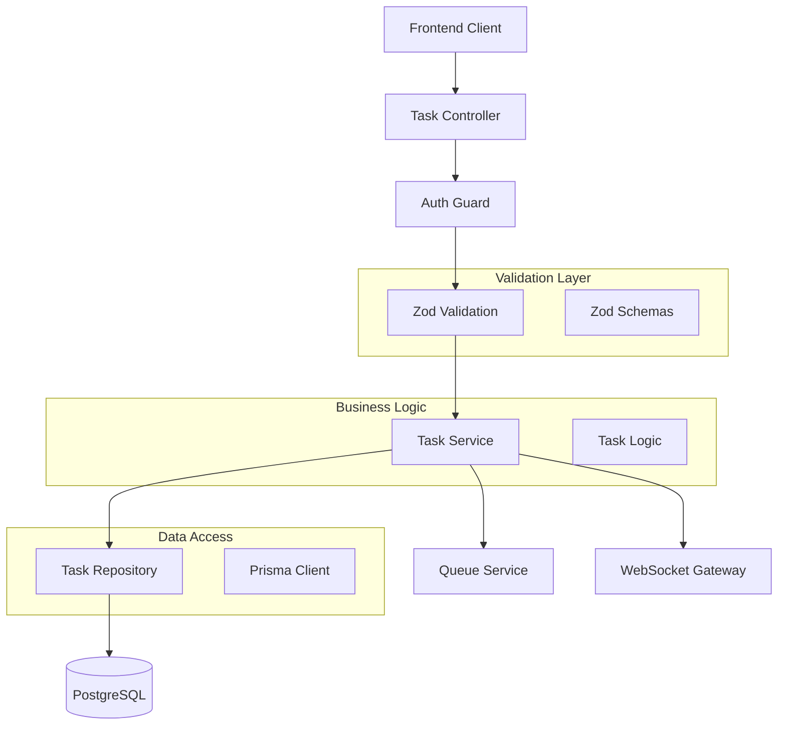

# Design Document

## Overview

The Task CRUD API design provides a comprehensive RESTful interface for managing Claude Code tasks through NestJS controllers with full validation, authentication, and real-time integration. This design implements type-safe endpoints using Zod schemas, follows OpenAPI standards, and integrates seamlessly with the database schema and WebSocket events for complete task lifecycle management.

## Steering Document Alignment

### Technical Standards (tech.md)
- **NestJS Framework**: Structured TypeScript backend with dependency injection and modular architecture
- **Zod Validation**: Schema-first approach creating single source of truth for types and validation
- **JWT Authentication**: Passport.js integration with stateless authentication and secure token handling
- **OpenAPI Documentation**: Auto-generated specifications from Zod schemas and NestJS decorators

### Project Structure (structure.md)
- **Controller Location**: `apps/backend/src/tasks/task.controller.ts`
- **Service Layer**: `apps/backend/src/tasks/task.service.ts`
- **Repository Pattern**: `apps/backend/src/tasks/task.repository.ts`
- **Shared Schemas**: `packages/schemas/src/tasks/` for cross-application consistency

## Code Reuse Analysis

### Existing Components to Leverage
- **Auth Module**: Extend existing JWT authentication and guard system
- **Database Module**: Utilize existing Prisma integration and connection management
- **Common Module**: Reuse decorators, filters, guards, and pipes from existing structure
- **Validation System**: Build upon existing input validation patterns

### Integration Points
- **WebSocket Gateway**: Emit task events for real-time dashboard updates
- **Queue Service**: Integrate with BullMQ for task processing coordination
- **User Service**: Leverage existing user management and permission systems
- **Database Schema**: Utilize ClaudeTask and related entities from database design

## Architecture

The API follows NestJS best practices with clear separation of concerns and type-safe interfaces:



### Modular Design Principles
- **Single File Responsibility**: Each controller method handles one specific endpoint operation
- **Component Isolation**: Controllers handle HTTP concerns, services contain business logic
- **Service Layer Separation**: Clear boundaries between presentation, business, and data layers
- **Utility Modularity**: Shared validation schemas and DTOs across packages

## Components and Interfaces

### TaskController
- **Purpose:** HTTP endpoint handling for all task CRUD operations
- **Interfaces:** REST endpoints with OpenAPI documentation and type-safe responses
- **Dependencies:** TaskService, AuthGuard, ValidationPipe, WebSocketGateway
- **Reuses:** Existing controller patterns, authentication decorators, response formatting

### TaskService
- **Purpose:** Business logic coordination for task lifecycle management
- **Interfaces:** Type-safe methods for all task operations with comprehensive error handling
- **Dependencies:** TaskRepository, QueueService, UserService, notification systems
- **Reuses:** Existing service patterns, dependency injection, transaction management

### TaskRepository
- **Purpose:** Data access layer with optimized queries and relationship management
- **Interfaces:** Repository pattern methods with Prisma integration
- **Dependencies:** PrismaService, database connection management
- **Reuses:** Existing repository patterns, query optimization, connection pooling

### Validation Schemas (Zod)
- **Purpose:** Type-safe validation and OpenAPI generation for all endpoints
- **Interfaces:** Request/response DTOs with comprehensive validation rules
- **Dependencies:** Shared type definitions, validation utilities
- **Reuses:** Existing validation patterns, shared schema structure

## Data Models

### CreateTaskDto
```typescript
export const CreateTaskSchema = z.object({
  title: z.string().min(1).max(200),
  description: z.string().optional(),
  prompt: z.string().min(1).max(10000),
  config: z.object({
    timeout: z.number().int().min(1).max(3600).optional(),
    retryAttempts: z.number().int().min(0).max(5).optional(),
    priority: z.enum(['LOW', 'MEDIUM', 'HIGH', 'URGENT']).optional()
  }).optional(),
  projectId: z.string().uuid().optional(),
  tags: z.array(z.string().max(50)).max(10).optional(),
  scheduledAt: z.string().datetime().optional()
});

export type CreateTaskDto = z.infer<typeof CreateTaskSchema>;
```

### UpdateTaskDto
```typescript
export const UpdateTaskSchema = z.object({
  title: z.string().min(1).max(200).optional(),
  description: z.string().optional(),
  config: z.object({
    timeout: z.number().int().min(1).max(3600).optional(),
    retryAttempts: z.number().int().min(0).max(5).optional(),
    priority: z.enum(['LOW', 'MEDIUM', 'HIGH', 'URGENT']).optional()
  }).optional(),
  tags: z.array(z.string().max(50)).max(10).optional(),
  scheduledAt: z.string().datetime().optional()
});

export type UpdateTaskDto = z.infer<typeof UpdateTaskSchema>;
```

### TaskQueryDto
```typescript
export const TaskQuerySchema = z.object({
  page: z.number().int().min(1).default(1),
  limit: z.number().int().min(1).max(100).default(20),
  status: z.array(z.enum(['PENDING', 'RUNNING', 'COMPLETED', 'FAILED', 'CANCELLED'])).optional(),
  priority: z.array(z.enum(['LOW', 'MEDIUM', 'HIGH', 'URGENT'])).optional(),
  projectId: z.string().uuid().optional(),
  createdAfter: z.string().datetime().optional(),
  createdBefore: z.string().datetime().optional(),
  search: z.string().max(100).optional(),
  sortBy: z.enum(['createdAt', 'updatedAt', 'priority', 'status']).default('createdAt'),
  sortOrder: z.enum(['asc', 'desc']).default('desc')
});

export type TaskQueryDto = z.infer<typeof TaskQuerySchema>;
```

### TaskResponseDto
```typescript
export const TaskResponseSchema = z.object({
  id: z.string().uuid(),
  title: z.string(),
  description: z.string().nullable(),
  prompt: z.string(),
  status: z.enum(['PENDING', 'RUNNING', 'COMPLETED', 'FAILED', 'CANCELLED']),
  priority: z.enum(['LOW', 'MEDIUM', 'HIGH', 'URGENT']),
  progress: z.number().min(0).max(1).nullable(),
  config: z.object({
    timeout: z.number().optional(),
    retryAttempts: z.number().optional(),
    priority: z.string().optional()
  }).nullable(),
  createdBy: z.object({
    id: z.string().uuid(),
    username: z.string(),
    email: z.string()
  }),
  project: z.object({
    id: z.string().uuid(),
    name: z.string()
  }).nullable(),
  tags: z.array(z.string()),
  createdAt: z.string().datetime(),
  updatedAt: z.string().datetime(),
  scheduledAt: z.string().datetime().nullable(),
  startedAt: z.string().datetime().nullable(),
  completedAt: z.string().datetime().nullable(),
  estimatedDuration: z.number().nullable(),
  actualDuration: z.number().nullable()
});

export type TaskResponseDto = z.infer<typeof TaskResponseSchema>;
```

## Error Handling

### Error Scenarios
1. **Validation Errors**
   - **Handling:** Zod validation with field-specific error messages and HTTP 400 responses
   - **User Impact:** Clear, actionable feedback for form corrections

2. **Authorization Failures**
   - **Handling:** JWT verification with proper HTTP 401/403 responses and token refresh guidance
   - **User Impact:** Secure access control with helpful authentication guidance

3. **Resource Not Found**
   - **Handling:** Database query validation with HTTP 404 responses and resource identification
   - **User Impact:** Clear indication of missing resources with suggested actions

4. **Business Logic Violations**
   - **Handling:** Service-layer validation with HTTP 409 responses and context explanation
   - **User Impact:** Understanding of business rules and alternative actions

5. **Database Constraints**
   - **Handling:** Prisma error transformation with HTTP 500 responses and safe error exposure
   - **User Impact:** Generic error messages protecting system internals while providing support context

## Testing Strategy

### Unit Testing
- Controller endpoint testing with mocked dependencies
- Service business logic testing with isolated components
- Repository data access testing with database transactions
- Validation schema testing with comprehensive edge cases

### Integration Testing
- Full endpoint testing with real database connections
- Authentication flow testing with JWT token lifecycle
- WebSocket event emission testing with real-time updates
- Queue integration testing with BullMQ job coordination

### End-to-End Testing
- Complete task lifecycle API testing from creation to completion
- Multi-user scenario testing with permission boundaries
- Performance testing under concurrent load
- Error recovery testing with network failures and timeouts