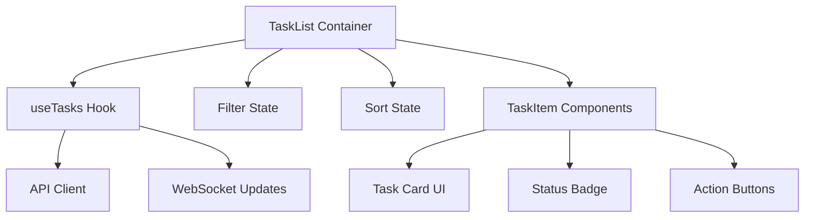

# Design Document - Task List Component

## Overview

A reusable React/Next.js component that displays a list of tasks with filtering, sorting, and responsive design. The component will be used across multiple pages (/tasks, /tasks/active, /tasks/completed) and provides a consistent task viewing experience.

## Steering Document Alignment

### Technical Standards (tech.md)
- Uses Next.js 14+ with App Router
- TypeScript for type safety
- Follows React best practices (hooks, component composition)
- Uses existing UI component library (shadcn/ui)

### Project Structure (structure.md)
- Component location: `apps/frontend/src/components/tasks/TaskList.tsx`
- Sub-components: `apps/frontend/src/components/tasks/TaskItem.tsx`
- Types: `apps/frontend/src/types/task.ts`
- Hooks: `apps/frontend/src/hooks/useTasks.ts`

## Code Reuse Analysis

### Existing Components to Leverage
- **Button component**: From `@/components/ui/button` for actions
- **Card component**: From `@/components/ui/card` for task items
- **Badge component**: From `@/components/ui/badge` for status indicators
- **Skeleton component**: From `@/components/ui/skeleton` for loading states
- **cn utility**: From `@/lib/utils` for className composition

### Integration Points
- **API Client**: Will integrate with existing API hooks for fetching tasks
- **WebSocket**: Will leverage existing WebSocket context for real-time updates
- **Theme System**: Uses existing theme variables and dark mode support

## Architecture

The component follows a container/presentational pattern:
- **TaskList** (container): Handles data fetching, filtering, and state management
- **TaskItem** (presentational): Pure component for rendering individual tasks



## Components and Interfaces

### TaskList Component
- **Purpose:** Container component managing task list state and rendering
- **Props:**
  ```typescript
  interface TaskListProps {
    initialFilter?: TaskFilter;
    enableFiltering?: boolean;
    enableSorting?: boolean;
    onTaskClick?: (taskId: string) => void;
    className?: string;
  }
  ```
- **Dependencies:** useTasks hook, TaskItem component
- **Reuses:** UI components (Button, Card, Skeleton), cn utility

### TaskItem Component
- **Purpose:** Presentational component for individual task display
- **Props:**
  ```typescript
  interface TaskItemProps {
    task: Task;
    onClick?: () => void;
    showActions?: boolean;
    className?: string;
  }
  ```
- **Dependencies:** UI components (Card, Badge, Button)
- **Reuses:** Badge, Button, Card from shadcn/ui

### useTasks Hook
- **Purpose:** Custom hook for task data fetching and state management
- **Interface:**
  ```typescript
  function useTasks(filter?: TaskFilter): {
    tasks: Task[];
    isLoading: boolean;
    error: Error | null;
    refetch: () => void;
  }
  ```
- **Dependencies:** API client, WebSocket context
- **Reuses:** Existing API patterns and WebSocket integration

## Data Models

### Task Type
```typescript
interface Task {
  id: string;
  title: string;
  description: string;
  status: TaskStatus;
  priority: TaskPriority;
  createdAt: string;
  updatedAt: string;
  completedAt?: string;
}

type TaskStatus = 'pending' | 'active' | 'completed' | 'failed';
type TaskPriority = 'low' | 'medium' | 'high';
```

### TaskFilter Type
```typescript
interface TaskFilter {
  status?: TaskStatus | TaskStatus[];
  priority?: TaskPriority | TaskPriority[];
  searchTerm?: string;
  dateRange?: { from: Date; to: Date };
}
```

## Error Handling

### Error Scenarios
1. **API Failure**
   - **Handling:** Display error message with retry button
   - **User Impact:** User sees friendly error message and can retry

2. **Empty State**
   - **Handling:** Display encouraging empty state with action prompt
   - **User Impact:** User is guided to create their first task

3. **Loading State**
   - **Handling:** Show skeleton loading UI
   - **User Impact:** User sees immediate visual feedback

## Testing Strategy

### Unit Testing
- Test TaskList filtering logic
- Test TaskItem rendering with different task states
- Test useTasks hook state management

### Integration Testing
- Test TaskList with real API responses
- Test WebSocket updates triggering list refresh
- Test filtering and sorting interactions

### End-to-End Testing
- Test full user journey: view tasks → filter → sort → click task
- Test responsive behavior on different screen sizes