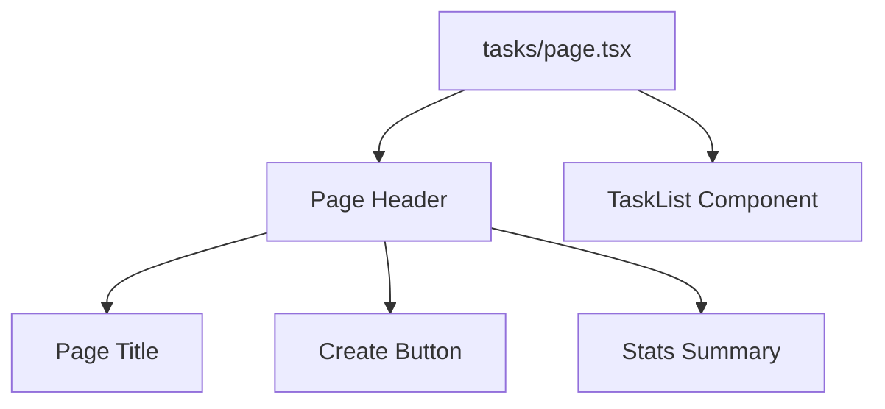

# Design Document - Tasks All Page

## Overview

A Next.js page component at /tasks that displays all tasks using the reusable TaskList component. This page provides the foundation for task management and integrates with the application navigation.

## Steering Document Alignment

### Technical Standards (tech.md)
- Next.js 14+ App Router
- Server Components where possible
- TypeScript strict mode
- TailwindCSS for styling

### Project Structure (structure.md)
- Page location: `apps/frontend/src/app/tasks/page.tsx`
- Leverages: `apps/frontend/src/components/tasks/TaskList.tsx`

## Code Reuse Analysis

### Existing Components to Leverage
- **TaskList component**: Main task list display and management
- **Page layout components**: Consistent with dashboard page structure
- **Navigation components**: Sidebar and Navigation components (uncomment task links)

### Integration Points
- **Navigation**: Uncomment task navigation links in Sidebar.tsx and Navigation.tsx
- **Layout**: Integrate with existing app layout and theme
- **Authentication**: Use existing auth guards for page protection

## Architecture

Simple page component that composes existing components:

## Components and Interfaces

### TasksPage Component
- **Purpose:** Page component for /tasks route
- **Type:** React Server Component (can use RSC for SEO benefits)
- **Dependencies:** TaskList component
- **Reuses:** Existing page layout patterns from dashboard

## Data Models

Delegates all data handling to TaskList component - no page-level data models needed.

## Error Handling

### Error Scenarios
1. **Page Not Found After Uncommenting Links**
   - **Handling:** Create page file at correct location
   - **User Impact:** No 404 errors when clicking Tasks link

2. **TaskList Component Errors**
   - **Handling:** Delegate to TaskList error handling
   - **User Impact:** User sees TaskList error states

## Testing Strategy

### Unit Testing
- Test page renders correctly
- Test page metadata is set properly

### Integration Testing
- Test navigation to /tasks works from sidebar and top nav
- Test TaskList integration on page
- Test page layout matches design

### End-to-End Testing
- Test full user journey: click Tasks link → see all tasks → interact with list
- Test page accessibility with keyboard and screen reader