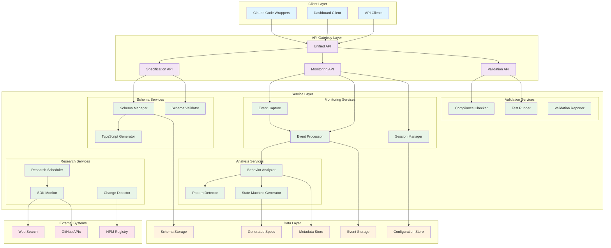
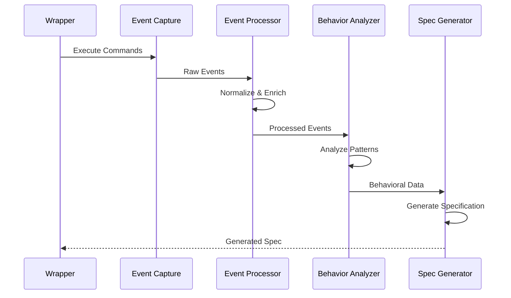
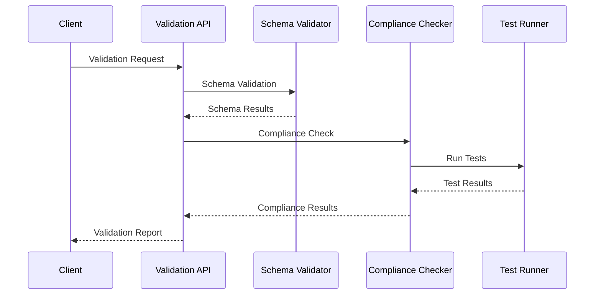
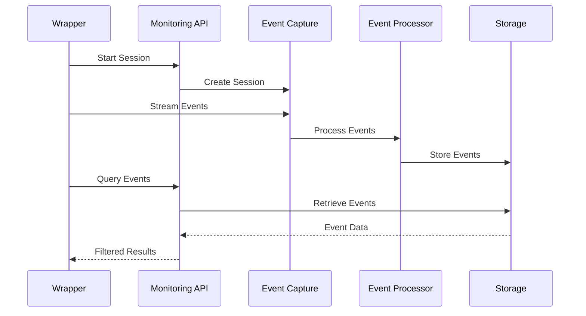
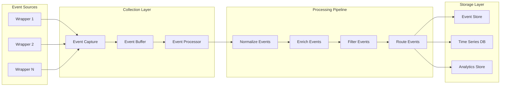
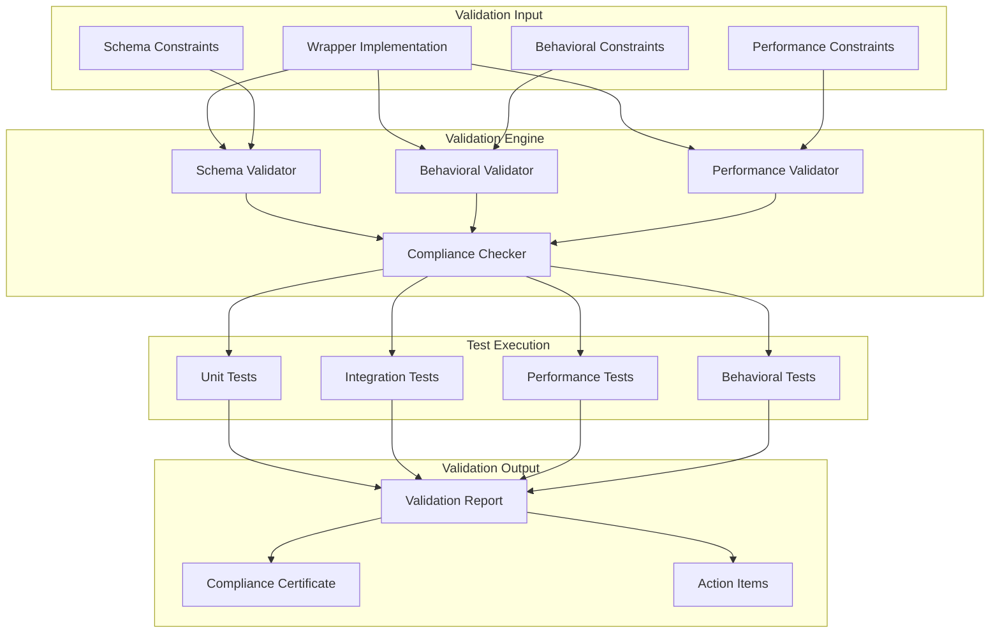
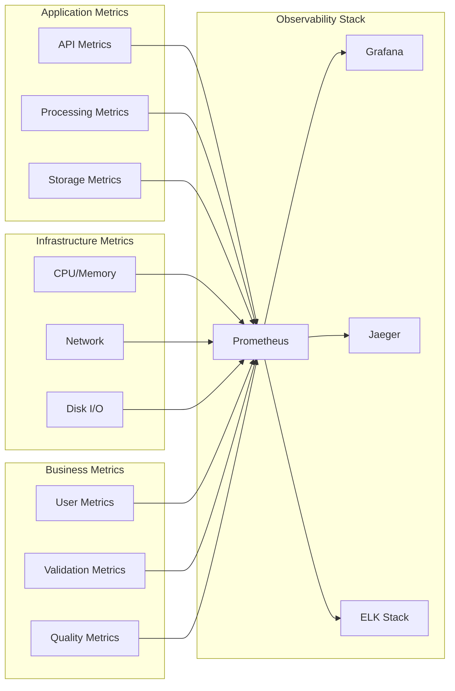
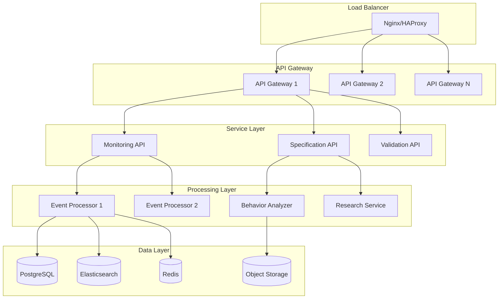

# Claude Code Specification System Architecture

## Overview

The Claude Code Specification System is a comprehensive framework for creating, validating, and maintaining specifications for Claude Code wrapper implementations. This document provides a detailed architectural overview of the system components, their interactions, and design decisions.

## Table of Contents

1. [System Architecture](#system-architecture)
2. [Component Overview](#component-overview)
3. [Data Flow](#data-flow)
4. [API Layer](#api-layer)
5. [Schema Management](#schema-management)
6. [Runtime Monitoring](#runtime-monitoring)
7. [Behavioral Analysis](#behavioral-analysis)
8. [Validation Framework](#validation-framework)
9. [Storage and Persistence](#storage-and-persistence)
10. [Security Considerations](#security-considerations)
11. [Scalability and Performance](#scalability-and-performance)
12. [Extension Points](#extension-points)

---

## System Architecture

### High-Level Architecture Diagram



### Architectural Principles

1. **Separation of Concerns**: Each component has a single, well-defined responsibility
2. **Modularity**: Components can be developed, tested, and deployed independently
3. **Extensibility**: New components can be added without modifying existing ones
4. **Resilience**: System degrades gracefully when components are unavailable
5. **Observability**: Comprehensive logging, monitoring, and metrics throughout
6. **Performance**: Optimized for high-throughput specification processing

---

## Component Overview

### 1. Schema Management System

**Purpose**: Manages JSON schemas for Claude Code communication protocols

**Components**:
- **Schema Manager**: CRUD operations for schemas
- **Schema Validator**: Runtime validation against schemas
- **TypeScript Generator**: Generates TypeScript interfaces from schemas

**Key Features**:
- JSON Schema Draft 2020-12 compliance
- Automatic TypeScript generation
- Schema versioning and evolution
- Validation caching for performance

```python
# Schema Manager Interface
class SchemaManager:
    def load_schema(self, schema_type: str) -> Dict[str, Any]
    def validate_schema(self, schema: Dict[str, Any]) -> ValidationResult
    def update_schema(self, schema_type: str, schema: Dict[str, Any]) -> bool
    def get_schema_metadata(self, schema_type: str) -> SchemaMetadata
```

### 2. Runtime Monitoring System

**Purpose**: Captures and processes runtime behavior from Claude Code wrappers

**Components**:
- **Event Capture**: Real-time event collection
- **Event Processor**: Event normalization and enrichment
- **Session Manager**: Monitoring session lifecycle management

**Event Types Captured**:
- Command execution events
- State transition events
- Error and exception events
- Performance metrics
- Custom wrapper events

```python
# Event Capture Interface
class EventCapture:
    def start_session(self, session_config: SessionConfig) -> str
    def capture_event(self, event: CapturedEvent) -> None
    def stop_session(self, session_id: str) -> SessionSummary
    def get_session_events(self, session_id: str) -> List[CapturedEvent]
```

### 3. Behavioral Analysis Engine

**Purpose**: Analyzes captured runtime data to generate behavioral specifications

**Components**:
- **Behavior Analyzer**: Main analysis orchestrator
- **Pattern Detector**: Identifies recurring behavioral patterns
- **State Machine Generator**: Creates formal state machines from observations

**Analysis Capabilities**:
- Event sequence pattern detection
- State transition analysis
- Timing pattern analysis
- Anomaly detection
- Compliance verification

```python
# Behavior Analyzer Interface
class BehaviorAnalyzer:
    def analyze_session(self, session_id: str) -> BehavioralSpecification
    def detect_patterns(self, events: List[CapturedEvent]) -> List[Pattern]
    def generate_state_machine(self, events: List[CapturedEvent]) -> StateMachine
    def compare_behaviors(self, spec1: BehavioralSpecification, spec2: BehavioralSpecification) -> ComparisonResult
```

### 4. Research and Change Detection System

**Purpose**: Monitors Claude Code ecosystem for changes and updates

**Components**:
- **SDK Monitor**: Tracks Claude Code SDK updates
- **Change Detector**: Identifies behavioral changes over time
- **Research Scheduler**: Manages automated research tasks

**Research Sources**:
- GitHub repositories
- NPM package registry
- Documentation websites
- Community forums

```python
# Research System Interface
class ResearchSystem:
    def schedule_research(self, research_config: ResearchConfig) -> str
    def detect_changes(self, comparison_period: timedelta) -> List[Change]
    def get_latest_sdk_info(self) -> SDKInfo
    def analyze_ecosystem_trends(self) -> TrendAnalysis
```

### 5. Validation Framework

**Purpose**: Validates wrapper implementations against specifications

**Components**:
- **Compliance Checker**: Comprehensive compliance testing
- **Test Runner**: Executes validation test suites
- **Validation Reporter**: Generates compliance reports

**Validation Types**:
- Schema compliance validation
- Behavioral pattern validation
- Performance compliance validation
- Security compliance validation

```python
# Validation Framework Interface
class ValidationFramework:
    def run_compliance_check(self, wrapper_path: str, spec_name: str) -> ComplianceResult
    def validate_against_schema(self, data: Any, schema_type: str) -> ValidationResult
    def run_test_suite(self, test_config: TestConfig) -> TestResults
    def generate_compliance_report(self, results: List[ComplianceResult]) -> ComplianceReport
```

---

## Data Flow

### 1. Specification Generation Flow



### 2. Validation Flow



### 3. Monitoring Flow



---

## API Layer

### REST API Design

The system exposes three main REST APIs following OpenAPI 3.0 specifications:

#### 1. Specification API (`/api/v1/specifications`)

**Endpoints**:
- `GET /specifications` - List all specifications
- `GET /specifications/{name}` - Get specific specification
- `POST /specifications/{name}` - Create new specification
- `PUT /specifications/{name}` - Update specification
- `DELETE /specifications/{name}` - Delete specification
- `GET /specifications/schemas/{type}` - Get schema by type
- `POST /specifications/generate` - Generate specification from data

#### 2. Monitoring API (`/api/v1/monitoring`)

**Endpoints**:
- `GET /monitoring/status` - System status
- `POST /monitoring/sessions` - Start monitoring session
- `GET /monitoring/sessions` - List sessions
- `GET /monitoring/sessions/{id}` - Get session details
- `POST /monitoring/sessions/{id}/stop` - Stop session
- `GET /monitoring/events` - Query events
- `POST /monitoring/events` - Capture event
- `WS /monitoring/stream` - WebSocket event stream

#### 3. Validation API (`/api/v1/validation`)

**Endpoints**:
- `POST /validation/validate` - Validate data against schema
- `POST /validation/compliance` - Run compliance check
- `GET /validation/results/{id}` - Get validation results
- `GET /validation/history` - Validation history
- `POST /validation/test-suite` - Run test suite

### API Response Format

All APIs use a consistent response format:

```typescript
interface APIResponse<T = any> {
  success: boolean;
  data?: T;
  error?: string;
  timestamp: string;
  version: string;
  request_id?: string;
}
```

### Error Handling

The API implements comprehensive error handling:

- **400 Bad Request**: Invalid request data
- **401 Unauthorized**: Authentication required
- **403 Forbidden**: Insufficient permissions
- **404 Not Found**: Resource not found
- **409 Conflict**: Resource conflict
- **422 Unprocessable Entity**: Validation errors
- **429 Too Many Requests**: Rate limit exceeded
- **500 Internal Server Error**: Server error
- **503 Service Unavailable**: Service temporarily unavailable

---

## Schema Management

### Schema Types

The system manages three core schema types:

1. **Commands Schema** (`commands.json`)
   - Defines valid command structures
   - Validates command payloads
   - Supports legacy command formats

2. **Events Schema** (`events.json`)
   - Defines event structure and types
   - Validates event data
   - Supports custom event types

3. **States Schema** (`states.json`)
   - Defines valid system states
   - Validates state transitions
   - Supports nested state hierarchies

### Schema Evolution

The system supports schema evolution through:

- **Versioning**: Schemas are versioned using semantic versioning
- **Backward Compatibility**: New versions maintain compatibility with older versions
- **Migration Tools**: Automated tools for migrating between schema versions
- **Validation**: Schema changes are validated before deployment

### TypeScript Generation

Automatic TypeScript interface generation provides:

- Type-safe wrapper development
- IntelliSense support in IDEs
- Compile-time validation
- Generated documentation

---

## Runtime Monitoring

### Event Collection Architecture



### Event Processing Pipeline

1. **Collection**: Events collected from multiple wrapper instances
2. **Buffering**: Events buffered for batch processing
3. **Normalization**: Events normalized to consistent format
4. **Enrichment**: Events enriched with metadata and context
5. **Filtering**: Events filtered based on relevance and quality
6. **Routing**: Events routed to appropriate storage systems

### Session Management

Sessions provide isolated monitoring contexts:

- **Session Lifecycle**: Start, active, stopped, archived
- **Session Configuration**: Capture options, filters, metadata
- **Session Analytics**: Event counts, duration, patterns
- **Session Cleanup**: Automatic cleanup of old sessions

---

## Behavioral Analysis

### Pattern Detection Algorithms

The system employs multiple algorithms for pattern detection:

1. **Sequence Mining**: Identifies recurring event sequences
2. **Temporal Pattern Analysis**: Detects timing-based patterns
3. **State Transition Analysis**: Analyzes state change patterns
4. **Anomaly Detection**: Identifies unusual behavioral patterns

### State Machine Generation

State machines are generated through:

1. **State Extraction**: Extract unique states from events
2. **Transition Mapping**: Map state transitions from event sequences
3. **Probability Calculation**: Calculate transition probabilities
4. **Machine Optimization**: Optimize state machine for clarity and performance

### Behavioral Specification Format

Generated specifications include:

```json
{
  "version": "1.0.0",
  "generated_at": "2023-12-01T10:00:00Z",
  "wrapper_name": "ExampleWrapper",
  "state_machine": {
    "states": ["idle", "executing", "terminating"],
    "transitions": [
      {"from": "idle", "to": "executing", "trigger": "command_received"},
      {"from": "executing", "to": "idle", "trigger": "execution_completed"}
    ]
  },
  "behavioral_patterns": [
    {
      "pattern": "command_validation_before_execution",
      "confidence": 0.95,
      "examples": ["..."]
    }
  ],
  "performance_characteristics": {
    "average_execution_time": 2.5,
    "memory_usage_patterns": "...",
    "error_rates": 0.02
  }
}
```

---

## Validation Framework

### Validation Architecture



### Validation Types

1. **Schema Validation**
   - Command structure validation
   - Event format validation
   - State definition validation

2. **Behavioral Validation**
   - State transition compliance
   - Event sequence validation
   - Pattern adherence checking

3. **Performance Validation**
   - Response time validation
   - Resource usage validation
   - Throughput validation

4. **Security Validation**
   - Input sanitization validation
   - Error handling validation
   - Access control validation

### Compliance Scoring

Compliance scores are calculated using:

```python
def calculate_compliance_score(validation_results: ValidationResults) -> float:
    weights = {
        'schema_compliance': 0.3,
        'behavioral_compliance': 0.4,
        'performance_compliance': 0.2,
        'security_compliance': 0.1
    }

    weighted_score = sum(
        results.get(category, 0) * weight
        for category, weight in weights.items()
    )

    return min(1.0, weighted_score)
```

---

## Storage and Persistence

### Data Storage Strategy

The system uses a multi-tier storage approach:

1. **Hot Storage** (Real-time access)
   - In-memory caches for active sessions
   - Redis for session state and event buffers
   - SQLite for configuration and metadata

2. **Warm Storage** (Frequent access)
   - PostgreSQL for structured data
   - Elasticsearch for event search and analytics
   - File system for generated specifications

3. **Cold Storage** (Archival)
   - Amazon S3 or compatible object storage
   - Compressed event archives
   - Long-term compliance records

### Data Models

#### Event Data Model

```python
@dataclass
class CapturedEvent:
    event_id: str
    event_type: str
    timestamp: datetime
    session_id: str
    wrapper_name: str
    data: Dict[str, Any]
    metadata: EventMetadata
```

#### Specification Data Model

```python
@dataclass
class BehavioralSpecification:
    name: str
    version: str
    generated_at: datetime
    state_machine: StateMachine
    behavioral_patterns: List[Pattern]
    performance_characteristics: PerformanceProfile
    compliance_rules: List[ComplianceRule]
```

### Data Retention Policies

- **Event Data**: 90 days hot, 1 year warm, 7 years cold
- **Specifications**: Indefinite with versioning
- **Session Data**: 30 days hot, 6 months warm
- **Validation Results**: 1 year with compliance audit trail

---

## Security Considerations

### Authentication and Authorization

The system implements multiple security layers:

1. **API Authentication**
   - JWT-based authentication
   - API key authentication for service accounts
   - OAuth 2.0 integration for third-party access

2. **Authorization Model**
   - Role-based access control (RBAC)
   - Resource-level permissions
   - Audit logging for all access

3. **Data Protection**
   - Encryption at rest using AES-256
   - Encryption in transit using TLS 1.3
   - Secure key management

### Security Threats and Mitigations

| Threat | Mitigation |
|--------|------------|
| Data injection attacks | Input validation and sanitization |
| Unauthorized access | Strong authentication and authorization |
| Data breaches | Encryption and access controls |
| DoS attacks | Rate limiting and resource monitoring |
| Code injection | Sandboxed execution environments |
| Man-in-the-middle | TLS encryption and certificate validation |

### Compliance and Auditing

The system supports compliance with:

- **SOC 2 Type II**: Security, availability, processing integrity
- **ISO 27001**: Information security management
- **GDPR**: Data protection and privacy
- **CCPA**: California Consumer Privacy Act

---

## Scalability and Performance

### Horizontal Scaling

The system is designed for horizontal scaling:

1. **Stateless Services**: All services are stateless and can be scaled independently
2. **Load Balancing**: Traffic distributed across multiple service instances
3. **Database Sharding**: Event data sharded by time and wrapper ID
4. **Caching Strategy**: Multi-level caching for performance optimization

### Performance Characteristics

- **Event Processing**: 10,000+ events/second per instance
- **API Response Time**: <100ms for 95th percentile
- **Validation Throughput**: 1,000+ validations/minute
- **Analysis Processing**: Real-time for sessions <1M events

### Monitoring and Observability



---

## Extension Points

### Plugin Architecture

The system supports extensions through:

1. **Event Processors**: Custom event processing logic
2. **Validators**: Custom validation rules and checks
3. **Analyzers**: Custom behavioral analysis algorithms
4. **Reporters**: Custom report generation

### Custom Schema Types

New schema types can be added:

```python
class CustomSchemaType(SchemaType):
    def __init__(self, name: str, schema: Dict[str, Any]):
        self.name = name
        self.schema = schema

    def validate(self, data: Any) -> ValidationResult:
        # Custom validation logic
        pass

    def generate_typescript(self) -> str:
        # Custom TypeScript generation
        pass
```

### Integration APIs

The system provides integration points for:

- **CI/CD Pipelines**: Automated validation in build processes
- **IDE Extensions**: Real-time validation in development environments
- **Monitoring Tools**: Integration with existing monitoring infrastructure
- **Testing Frameworks**: Custom test runners and assertions

### Future Extension Opportunities

1. **Machine Learning Integration**: AI-powered pattern detection and anomaly identification
2. **Multi-Language Support**: Extension to support wrappers in multiple programming languages
3. **Cloud Integration**: Native integration with cloud platforms and services
4. **Real-time Collaboration**: Multi-user specification development and review

---

## Deployment Architecture

### Container-Based Deployment



### Infrastructure Requirements

**Minimum Production Setup**:
- **API Gateway**: 2 instances, 2 CPU, 4GB RAM
- **Service Layer**: 3 instances, 2 CPU, 4GB RAM each
- **Processing Layer**: 2 instances, 4 CPU, 8GB RAM each
- **Database**: PostgreSQL cluster, 4 CPU, 16GB RAM
- **Cache**: Redis cluster, 2 CPU, 8GB RAM
- **Storage**: 1TB initial, auto-scaling

**Recommended Production Setup**:
- **API Gateway**: 3 instances, 4 CPU, 8GB RAM
- **Service Layer**: 6 instances, 4 CPU, 8GB RAM each
- **Processing Layer**: 4 instances, 8 CPU, 16GB RAM each
- **Database**: PostgreSQL cluster, 8 CPU, 32GB RAM
- **Cache**: Redis cluster, 4 CPU, 16GB RAM
- **Storage**: 5TB initial, auto-scaling

This architecture provides a robust, scalable, and maintainable foundation for the Claude Code Specification System, enabling comprehensive wrapper specification management and validation capabilities.