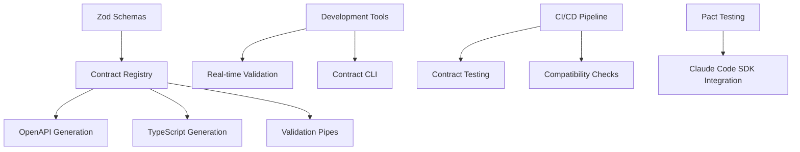

# Contract-Driven Development Guide

## Overview

The Claude Code Task Manager implements a comprehensive contract-driven development approach where all APIs, integrations, and data exchanges are defined by explicit, validated contracts. This system establishes contracts as the single source of truth for system interfaces, enabling automatic documentation generation, type safety, consumer-driven testing, and seamless integration workflows.

## Key Benefits

- **Single Source of Truth**: Zod schemas serve as the authoritative definition for validation, types, and documentation
- **Automatic Documentation**: OpenAPI specs are auto-generated from contracts
- **Type Safety**: TypeScript types are automatically generated for both frontend and backend
- **Contract Testing**: Consumer-driven testing ensures Claude Code SDK integration compatibility
- **Real-time Validation**: Development-time contract validation catches violations immediately
- **Version Management**: Backward compatibility guarantees with clear deprecation timelines

## Architecture

The contract-driven architecture implements a layered approach where contracts serve as the interface definition between all system components:



## Core Components

### 1. Contract Registry (`src/contracts/ContractRegistry.ts`)

The central hub for managing all system contracts with versioning support.

```typescript
import { ContractRegistry } from '@/contracts/ContractRegistry';

// Register a new contract
contractRegistry.registerContract('task-execution', TaskExecutionRequestSchema, '1.0.0');

// Retrieve a contract
const contract = contractRegistry.getContract('task-execution', '1.0.0');

// Check compatibility
const compatibility = contractRegistry.validateCompatibility(oldSchema, newSchema);
```

**Key Features:**
- Centralized schema storage with version control
- Compatibility checking between schema versions
- Integration with existing Zod patterns

### 2. OpenAPI Generation (`src/contracts/ApiContractGenerator.ts`)

Automatically generates OpenAPI 3.0 specifications from Zod schemas.

```typescript
import { ApiContractGenerator } from '@/contracts/ApiContractGenerator';

const generator = new ApiContractGenerator();
const openApiSpec = generator.generateOpenAPI(contracts);
```

**Key Features:**
- Complete OpenAPI 3.0 specification generation
- Request/response examples and validation rules
- Integration with NestJS Swagger for interactive testing

### 3. TypeScript Generation (`src/contracts/TypeScriptGenerator.ts`)

Generates TypeScript types from contracts for compile-time safety.

```typescript
// Generated types are automatically available
import type { TaskExecutionRequest, TaskExecutionResponse } from '@/types/generated';

// Type-safe API calls
const request: TaskExecutionRequest = {
  task: "analyze code",
  options: { timeout: 30000 }
};
```

**Key Features:**
- Automatic type generation from Zod schemas
- Build-time integration for continuous updates
- Type-safe API clients

### 4. Contract Validation (`src/contracts/ContractValidationPipe.ts`)

NestJS pipe for contract-based request validation.

```typescript
@Post('tasks')
@UsePipes(new ContractValidationPipe('task-execution'))
async executeTask(@Body() request: TaskExecutionRequest) {
  // Request is automatically validated against contract
  return this.workerService.executeTask(request);
}
```

**Key Features:**
- Automatic request validation against contracts
- Structured error responses with field-level details
- Integration with NestJS validation system

### 5. Development Validation (`src/contracts/DevValidationMiddleware.ts`)

Real-time contract validation during development.

```typescript
// Automatically validates contracts in development mode
// Provides immediate feedback on contract violations
// Integrates with hot-reload for instant validation
```

**Key Features:**
- Real-time contract validation during development
- Clear error messages with suggested fixes
- Hot-reload integration

### 6. Version Management (`src/contracts/VersionManager.ts`)

Manages contract versioning with backward compatibility guarantees.

```typescript
import { VersionManager } from '@/contracts/VersionManager';

// Check if changes are backward compatible
const isCompatible = versionManager.isBackwardCompatible(oldVersion, newVersion);

// Handle deprecation
versionManager.deprecateVersion('task-execution', '1.0.0', '2024-12-31');
```

**Key Features:**
- Semantic versioning for contracts
- Backward compatibility checking
- Deprecation timeline management

### 7. Consumer-Driven Testing (`src/contracts/tests/PactTestRunner.ts`)

Pact-based contract testing for Claude Code SDK integration.

```typescript
// Contract tests verify Claude Code SDK integration
describe('Claude Code Contract Tests', () => {
  it('should verify task execution contract', async () => {
    // Tests ensure compatibility during SDK upgrades
    await pactTestRunner.verifyProvider('task-execution');
  });
});
```

**Key Features:**
- Consumer-driven contract testing
- Claude Code SDK integration verification
- Breaking change detection

## Usage Examples

### Creating a New Contract

1. **Define the Zod Schema:**

```typescript
// src/contracts/schemas/user-management.schema.ts
import { z } from 'zod';

export const CreateUserRequestSchema = z.object({
  email: z.string().email(),
  name: z.string().min(1).max(100),
  role: z.enum(['admin', 'user'])
});

export const UserResponseSchema = z.object({
  id: z.string().uuid(),
  email: z.string().email(),
  name: z.string(),
  role: z.enum(['admin', 'user']),
  createdAt: z.date()
});

export type CreateUserRequest = z.infer<typeof CreateUserRequestSchema>;
export type UserResponse = z.infer<typeof UserResponseSchema>;
```

2. **Register the Contract:**

```typescript
// Register during application bootstrap
contractRegistry.registerContract('create-user', CreateUserRequestSchema, '1.0.0');
contractRegistry.registerContract('user-response', UserResponseSchema, '1.0.0');
```

3. **Use in Controller:**

```typescript
@Controller('users')
export class UsersController {
  @Post()
  @UsePipes(new ContractValidationPipe('create-user'))
  @ApiOperation({ summary: 'Create a new user' })
  async createUser(@Body() request: CreateUserRequest): Promise<UserResponse> {
    return this.usersService.createUser(request);
  }
}
```

### Adding Contract Validation to Existing Endpoints

```typescript
// Before: Basic validation
@Post('tasks')
async executeTask(@Body() request: any) {
  return this.workerService.executeTask(request);
}

// After: Contract-driven validation
@Post('tasks')
@UsePipes(new ContractValidationPipe('task-execution'))
async executeTask(@Body() request: TaskExecutionRequest) {
  return this.workerService.executeTask(request);
}
```

### Testing Contracts

```typescript
// Unit test for contract validation
describe('Task Execution Contract', () => {
  it('should validate valid request', () => {
    const validRequest = {
      task: "analyze code",
      options: { timeout: 30000 }
    };
    
    const result = TaskExecutionRequestSchema.safeParse(validRequest);
    expect(result.success).toBe(true);
  });

  it('should reject invalid request', () => {
    const invalidRequest = {
      task: "", // Invalid: empty string
      options: { timeout: "invalid" } // Invalid: string instead of number
    };
    
    const result = TaskExecutionRequestSchema.safeParse(invalidRequest);
    expect(result.success).toBe(false);
  });
});
```

## CLI Tools

The contract CLI provides comprehensive contract management operations:

```bash
# Validate all contracts
npm run contract:validate

# Generate OpenAPI documentation
npm run contract:generate-docs

# Check contract compatibility
npm run contract:check-compatibility --old=1.0.0 --new=1.1.0

# Generate TypeScript types
npm run contract:generate-types

# Run contract tests
npm run contract:test

# List all registered contracts
npm run contract:list
```

### CLI Usage Examples

```bash
# Validate a specific contract
npx ts-node scripts/contract-cli.ts validate --contract=task-execution

# Generate documentation for specific contracts
npx ts-node scripts/contract-cli.ts generate-docs --contracts=task-execution,user-management

# Check if schema changes are backward compatible
npx ts-node scripts/contract-cli.ts check-compatibility \
  --schema=TaskExecutionRequestSchema \
  --old-version=1.0.0 \
  --new-version=1.1.0
```

## CI/CD Integration

Contract validation is automatically enforced in the CI/CD pipeline:

```yaml
# .github/workflows/contract-validation.yml
name: Contract Validation

on: [push, pull_request]

jobs:
  contract-validation:
    runs-on: ubuntu-latest
    steps:
      - uses: actions/checkout@v3
      - name: Setup Node.js
        uses: actions/setup-node@v3
        with:
          node-version: '18'
      - name: Install dependencies
        run: npm ci
      - name: Validate contracts
        run: npm run contract:validate
      - name: Check compatibility
        run: npm run contract:check-compatibility
      - name: Run contract tests
        run: npm run contract:test
```

**Pipeline Features:**
- Automatic contract validation on every push
- Build failure on contract violations
- Compatibility checks for pull requests
- Consumer-driven contract testing

## Error Handling

### Validation Errors

When contract validation fails, the system returns structured error responses:

```typescript
// Example validation error response
{
  "statusCode": 400,
  "message": "Contract validation failed",
  "errors": [
    {
      "field": "options.timeout",
      "message": "Expected number, received string",
      "code": "invalid_type"
    },
    {
      "field": "task",
      "message": "String must contain at least 1 character(s)",
      "code": "too_small"
    }
  ],
  "contract": "task-execution",
  "version": "1.0.0"
}
```

### Development Error Messages

During development, the system provides actionable error messages:

```typescript
// Development console output
Contract Validation Error: task-execution v1.0.0
├─ Field: options.timeout
│  ├─ Expected: number
│  ├─ Received: string
│  └─ Fix: Convert "30000" to 30000
└─ Field: task
   ├─ Expected: non-empty string
   ├─ Received: ""
   └─ Fix: Provide a task description
```

## Best Practices

### 1. Schema Design

- **Use descriptive field names** that clearly indicate their purpose
- **Add meaningful validation rules** (e.g., string length limits, number ranges)
- **Include detailed descriptions** for documentation generation
- **Use enums for fixed value sets** to ensure type safety

```typescript
// Good: Descriptive and well-validated
export const TaskExecutionRequestSchema = z.object({
  task: z.string()
    .min(1, "Task description is required")
    .max(1000, "Task description too long")
    .describe("Description of the task to execute"),
  
  options: z.object({
    timeout: z.number()
      .min(1000, "Timeout must be at least 1 second")
      .max(300000, "Timeout cannot exceed 5 minutes")
      .default(30000)
      .describe("Task execution timeout in milliseconds"),
    
    priority: z.enum(['low', 'normal', 'high'])
      .default('normal')
      .describe("Task execution priority")
  }).optional()
});
```

### 2. Versioning Strategy

- **Use semantic versioning** (MAJOR.MINOR.PATCH)
- **Increment MAJOR** for breaking changes
- **Increment MINOR** for backward-compatible additions
- **Increment PATCH** for backward-compatible bug fixes

```typescript
// Version 1.0.0 -> 1.1.0 (backward compatible)
const TaskExecutionRequestSchemaV1_1 = TaskExecutionRequestSchemaV1_0.extend({
  metadata: z.object({
    tags: z.array(z.string()).optional(),
    priority: z.enum(['low', 'normal', 'high']).default('normal')
  }).optional()
});

// Version 1.0.0 -> 2.0.0 (breaking change)
const TaskExecutionRequestSchemaV2_0 = z.object({
  // Renamed 'task' to 'description' (breaking change)
  description: z.string().min(1).max(1000),
  config: z.object({ // Restructured options (breaking change)
    timeoutMs: z.number().min(1000).max(300000),
    retryCount: z.number().min(0).max(3).default(0)
  })
});
```

### 3. Testing Strategies

```typescript
// Contract-specific tests
describe('Contract: Task Execution v1.0.0', () => {
  describe('Schema Validation', () => {
    it('should accept valid minimal request', () => {
      const request = { task: "analyze code" };
      expect(TaskExecutionRequestSchema.safeParse(request).success).toBe(true);
    });

    it('should accept valid complete request', () => {
      const request = {
        task: "analyze code",
        options: {
          timeout: 60000,
          priority: 'high' as const
        }
      };
      expect(TaskExecutionRequestSchema.safeParse(request).success).toBe(true);
    });

    it('should reject invalid requests', () => {
      const testCases = [
        { data: {}, expectedError: 'task is required' },
        { data: { task: '' }, expectedError: 'task cannot be empty' },
        { data: { task: 'valid', options: { timeout: 'invalid' } }, expectedError: 'timeout must be number' }
      ];

      testCases.forEach(({ data, expectedError }) => {
        const result = TaskExecutionRequestSchema.safeParse(data);
        expect(result.success).toBe(false);
        // Verify specific error message
      });
    });
  });

  describe('Backward Compatibility', () => {
    it('should maintain compatibility between versions', () => {
      const v1_0_request = { task: "analyze code" };
      
      // Should work with both v1.0 and v1.1 schemas
      expect(TaskExecutionRequestSchemaV1_0.safeParse(v1_0_request).success).toBe(true);
      expect(TaskExecutionRequestSchemaV1_1.safeParse(v1_0_request).success).toBe(true);
    });
  });
});
```

### 4. Integration with Existing Code

When integrating contracts with existing endpoints:

```typescript
// Step 1: Create contract for existing endpoint
export const ExistingEndpointSchema = z.object({
  // Define schema based on current implementation
});

// Step 2: Add gradual validation
@Post('existing-endpoint')
async existingEndpoint(@Body() request: any) {
  // Add contract validation alongside existing logic
  const validationResult = ExistingEndpointSchema.safeParse(request);
  if (!validationResult.success) {
    console.warn('Contract validation failed:', validationResult.error);
    // Log but don't fail - gradual migration
  }
  
  return this.existingService.handleRequest(request);
}

// Step 3: Enforce validation after testing
@Post('existing-endpoint')
@UsePipes(new ContractValidationPipe('existing-endpoint'))
async existingEndpoint(@Body() request: ExistingEndpointRequest) {
  return this.existingService.handleRequest(request);
}
```

## Troubleshooting

### Common Issues

#### 1. Contract Validation Failures

**Problem:** Requests failing validation unexpectedly

**Solution:**
1. Check the contract schema definition
2. Verify request payload matches expected structure
3. Use the development validation middleware for detailed error messages
4. Run contract validation tests

```bash
# Debug validation issues
npm run contract:validate --verbose
npm run contract:test --debug
```

#### 2. Type Generation Issues

**Problem:** TypeScript types not updating after schema changes

**Solution:**
1. Regenerate types manually
2. Check build process integration
3. Verify schema registration

```bash
# Regenerate types
npm run contract:generate-types

# Check type generation logs
npm run contract:generate-types --verbose
```

#### 3. Compatibility Check Failures

**Problem:** CI pipeline failing on compatibility checks

**Solution:**
1. Review schema changes for breaking modifications
2. Update version numbers appropriately
3. Add migration documentation for breaking changes

```bash
# Check what changes are breaking
npm run contract:check-compatibility --detailed
```

#### 4. Pact Test Failures

**Problem:** Consumer-driven contract tests failing

**Solution:**
1. Verify Claude Code SDK version compatibility
2. Update contract expectations
3. Check provider verification setup

```bash
# Run Pact tests with detailed output
npm run contract:test:pact --verbose
```

### Debug Mode

Enable debug mode for detailed contract validation logging:

```typescript
// Enable debug logging
process.env.CONTRACT_DEBUG = 'true';

// Or use environment-specific configuration
export const contractConfig = {
  debug: process.env.NODE_ENV === 'development',
  validateInProduction: true,
  logValidationErrors: true
};
```

## Migration Guide

### From Manual Documentation to Contract-Driven

1. **Audit Existing APIs:**
   ```bash
   # Generate report of current API endpoints
   npm run contract:audit-endpoints
   ```

2. **Create Schemas for Existing Endpoints:**
   ```typescript
   // Start with most critical endpoints
   export const CriticalEndpointSchema = z.object({
     // Map existing request structure to Zod schema
   });
   ```

3. **Add Gradual Validation:**
   ```typescript
   // Log validation failures without breaking functionality
   @Post('endpoint')
   async endpoint(@Body() request: any) {
     const validation = EndpointSchema.safeParse(request);
     if (!validation.success) {
       logger.warn('Contract validation failed', validation.error);
     }
     return this.service.handle(request);
   }
   ```

4. **Enable Full Validation:**
   ```typescript
   // Enforce contracts after testing period
   @UsePipes(new ContractValidationPipe('endpoint'))
   ```

5. **Generate Documentation:**
   ```bash
   # Auto-generate OpenAPI docs
   npm run contract:generate-docs
   ```

### Breaking Change Migration

When introducing breaking changes:

1. **Create New Version:**
   ```typescript
   // Register new major version
   contractRegistry.registerContract('endpoint', NewSchema, '2.0.0');
   ```

2. **Support Both Versions:**
   ```typescript
   @Post('endpoint')
   @ApiVersions(['1.0', '2.0'])
   async endpoint(@Body() request: any, @Version() version: string) {
     const schema = version === '2.0' ? NewSchema : LegacySchema;
     // Handle based on version
   }
   ```

3. **Deprecate Old Version:**
   ```typescript
   versionManager.deprecateVersion('endpoint', '1.0.0', '2024-12-31');
   ```

4. **Provide Migration Guide:**
   ```markdown
   ## Migration from v1.0 to v2.0
   
   ### Breaking Changes
   - Field `task` renamed to `description`
   - Field `options` restructured to `config`
   
   ### Migration Steps
   1. Update request structure
   2. Test with v2.0 endpoint
   3. Deploy before deprecation deadline
   ```

## Performance Considerations

### Validation Performance

- **Schema Compilation:** Zod schemas are compiled once at startup
- **Validation Caching:** Frequently validated requests benefit from result caching
- **Async Validation:** Contract validation is performed asynchronously where possible

### Development vs Production

```typescript
// Different validation strategies for different environments
export const validationConfig = {
  development: {
    enableRealTimeValidation: true,
    logAllValidations: true,
    validateResponses: true
  },
  production: {
    enableRealTimeValidation: false,
    logAllValidations: false,
    validateResponses: false, // Only validate requests
    enablePerformanceMonitoring: true
  }
};
```

### Monitoring

Track contract validation performance:

```typescript
// Monitor validation metrics
@Injectable()
export class ContractMetrics {
  private validationDuration = new Histogram({
    name: 'contract_validation_duration_seconds',
    help: 'Time spent validating contracts',
    labelNames: ['contract', 'version', 'status']
  });

  recordValidation(contract: string, version: string, duration: number, success: boolean) {
    this.validationDuration
      .labels(contract, version, success ? 'success' : 'failure')
      .observe(duration);
  }
}
```

## Integration with Claude Code SDK

The contract-driven system ensures seamless integration with the Claude Code SDK:

### SDK Contract Definition

```typescript
// Claude Code SDK contract
export const ClaudeCodeIntegrationSchema = z.object({
  command: z.enum(['execute', 'analyze', 'test']),
  payload: z.object({
    code: z.string(),
    context: z.record(z.any()).optional(),
    options: z.object({
      timeout: z.number().default(30000),
      maxTokens: z.number().default(4000)
    }).optional()
  })
});
```

### Provider Verification

```typescript
// Pact provider verification for Claude Code integration
describe('Claude Code Provider Contract', () => {
  it('should execute tasks according to contract', async () => {
    await pact
      .given('Claude Code SDK is available')
      .uponReceiving('a task execution request')
      .withRequest({
        method: 'POST',
        path: '/tasks/execute',
        body: like({
          command: 'execute',
          payload: {
            code: 'console.log("Hello World");',
            options: { timeout: 30000 }
          }
        })
      })
      .willRespondWith({
        status: 200,
        body: like({
          id: '123e4567-e89b-12d3-a456-426614174000',
          status: 'completed',
          result: 'Hello World'
        })
      });

    await pact.verify();
  });
});
```

## Future Enhancements

### Planned Features

1. **GraphQL Contract Support:** Extend contract system to GraphQL schemas
2. **Advanced Version Management:** Automatic schema evolution and migration tools
3. **Contract Governance:** Approval workflows for contract changes
4. **Performance Optimization:** Compiled validation for high-throughput scenarios
5. **Multi-Protocol Support:** Extend beyond HTTP to WebSocket and gRPC contracts

### Roadmap

- **Q1 2024:** Enhanced CLI tools and IDE integration
- **Q2 2024:** Advanced compatibility checking and auto-migration
- **Q3 2024:** Contract governance and approval workflows
- **Q4 2024:** Performance optimizations and caching improvements

## Contributing

When contributing to the contract-driven system:

1. **Follow Schema Conventions:** Use consistent naming and validation patterns
2. **Write Contract Tests:** Ensure comprehensive test coverage for new contracts
3. **Document Changes:** Update this guide when adding new features
4. **Version Appropriately:** Follow semantic versioning for contract changes
5. **Test Compatibility:** Verify backward compatibility for existing consumers

### Code Review Checklist

- [ ] Schema follows naming conventions
- [ ] Validation rules are appropriate and documented
- [ ] Backward compatibility is maintained (or version bumped)
- [ ] Tests cover edge cases and error scenarios
- [ ] Documentation is updated
- [ ] OpenAPI generation works correctly
- [ ] TypeScript types are generated properly
- [ ] Contract tests pass
- [ ] No breaking changes without version bump

---

This contract-driven development approach transforms the Claude Code Task Manager into a robust, type-safe, and well-documented system that ensures reliability and developer productivity while maintaining the flexibility to evolve and scale.